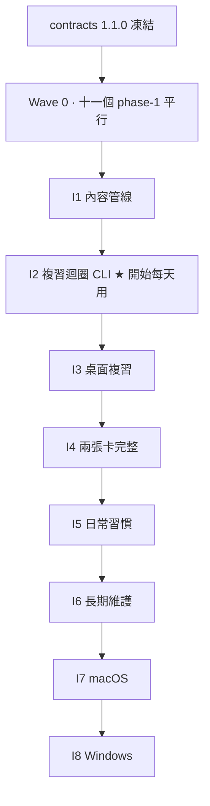

# Roadmap

一個 Wave + 八個 Integration。Wave 0 內部完全平行,I1–I8 嚴格依序。
每個 integration 通過時,系統都是完整可用的。

策略說明見 `05-parallel-and-integration.md`。

## 現況

| 欄位 | 值 |
|---|---|
| 目前階段 | I1 · 內容管線(Wave 0 已完成) |
| 目前 sprint | 2026-W36 — `01-data-layer/phase-2` |
| 契約版本 | 1.1.0(凍結) |
| 最後更新 | 2026-09-02 |

## 全貌

---

## Wave 0 · 十一個 phase-1,完全平行

**前提**:`contracts/types.md` 1.1.0 已凍結、`contracts/fixtures/` 已建立。

**規則**:這十一個 phase 之間**沒有任何依賴**。可以十一個同時開,也可以一次一個。
每個都只 import `contracts/`,跨資料夾 import 是違規。

| Phase | 交付 | 單獨執行 | Gherkin |
|---|---|---|---|
| 01-data-layer/phase-1 | zod schema、卡片驗證器、字數 | `npx tsx packages/core/src/schema/cli.ts validate <file>` | [phase-1](../features/01-data-layer/phase-1.feature) |
| 02-ingest-pipeline/phase-1 | raw → 卡片(FakeLlm) | `npx tsx scripts/ingest.ts --fake --file <raw>` | [phase-1](../features/02-ingest-pipeline/phase-1.feature) |
| 03-llm-router/phase-1 | 介面 + 雲端 adapter | `npx tsx scripts/llm.ts --task deepen --prompt "..."` | [phase-1](../features/03-llm-router/phase-1.feature) |
| 04-scheduler/phase-1 | 固定骨架純函式 | `npx tsx scripts/due.ts --state fixtures/reviews/mid-cycle.json` | [phase-1](../features/04-scheduler/phase-1.feature) |
| 05-grading/phase-1 | 填空三層 | `npx tsx scripts/grade.ts --fill --q <file> --answer "..."` | [phase-1](../features/05-grading/phase-1.feature) |
| 06-test-card/phase-1 | 考試卡 UI(stub 後端) | `npm run dev -w apps/test-card` | [phase-1](../features/06-test-card/phase-1.feature) |
| 07-teach-card/phase-1 | 教學卡 UI(MemoryFs) | `npm run dev -w apps/teach-card` | [phase-1](../features/07-teach-card/phase-1.feature) |
| 08-weekly-goal/phase-1 | 計數純函式 | `npx tsx scripts/weekly.ts --state <file>` | [phase-1](../features/08-weekly-goal/phase-1.feature) |
| 09-lint/phase-1 | 健檢(自帶最小驗證器) | `npx tsx scripts/lint.ts --dir fixtures/learning-broken` | [phase-1](../features/09-lint/phase-1.feature) |
| 10-desktop-shell/phase-1 | Tauri 兩視窗(placeholder) | `npm run tauri dev` | [phase-1](../features/10-desktop-shell/phase-1.feature) |
| 12-prompt-quality/phase-1 | golden 框架、結構檢查(FakeLlm) | `npx tsx scripts/prompt-check.ts --golden --fake` | [phase-1](../features/12-prompt-quality/phase-1.feature) |

**Wave 0 完成定義**:十一個 phase 全部 `done`,且 `standalone.json` 裡的非互動指令都能跑。

`11-review-cli` 不參與 Wave 0——它是組合層,在被組合的東西存在之前無法獨立(ADR-028)。

**順序完全自由。** 想從哪個開始都可以。要建議的話:`01-data-layer` 最先
(它把契約變成可執行的 schema,其他人整合時要用),`04-scheduler` 次之
(它是 I2 的關鍵路徑,而 I2 是第一個有價值的里程碑)。

---

## I1 · 內容管線

**你做得到什麼**:丟一篇文章進 `raw/`,執行一個指令,得到一疊可讀的卡片、考題和依賴順序。用 Obsidian 打開來看。

| 需要的 phase | 說明 |
|---|---|
| 01-data-layer/phase-2 | 考題、狀態檔、設定檔格式、原子寫入 |
| 01-data-layer/phase-3 | 依賴圖與拓樸排序 |
| 03-llm-router/phase-2 | 本機 + 路由表 |
| 02-ingest-pipeline/phase-2 | 考題、level 1、依賴圖 |

**整合工作**:02 丟掉自己的 FakeLlmRouter 改用 03;02 與 09 改用 01 的驗證器。

**驗收**:[i1-content-pipeline.feature](integration/i1-content-pipeline.feature)

**通過後立刻做**:把你手上三個類別的 raw 全部餵進去。

---

## I2 · 複習迴圈(CLI)★

**你做得到什麼**:**每天在終端機複習。間隔重複真的在跑。** 這是系統第一次有實際價值。

| 需要的 phase | 說明 |
|---|---|
| 04-scheduler/phase-2 | 錯誤回退、連錯、stuck |
| 04-scheduler/phase-3 | 每日上限、逾期比例 |
| 05-grading/phase-2 | 應用題 rubric |
| 11-review-cli/phase-1 | **把上面三個串成能用的東西** |
| 12-prompt-quality/phase-2 | 真模型 golden run,建立品質基準 |

**整合工作**:05 改用 03 的 router。

**驗收**:[i2-review-loop-headless.feature](integration/i2-review-loop-headless.feature)

**通過後立刻做**:每天用。連續用一週再往下走——UI 做得再漂亮,排程錯了都沒用。

---

## I3 · 桌面複習

**你做得到什麼**:在桌面視窗裡複習,不用開終端機。

| 需要的 phase | 說明 |
|---|---|
| 10-desktop-shell/phase-2 | Tauri commands、learning 路徑、fs scope |
| 06-test-card/phase-2 | 接上真的 scheduler 與 grading |
| 06-test-card/phase-3 | 進度、逾期、小結、續答 |
| 11-review-cli/phase-2 | session 邊界:續答、跨日、暫停 |

**整合工作**:06 丟掉 stub 改用 core;`MemoryFs` 換成 Tauri 的 `LearningFs`。

**驗收**:[i3-desktop-review.feature](integration/i3-desktop-review.feature)

---

## I4 · 兩張卡完整

**你做得到什麼**:完整的兩張卡。學新概念、往下鑽、被考。不用開 Obsidian。

| 需要的 phase | 說明 |
|---|---|
| 07-teach-card/phase-2 | 換類別、依賴順序、先備提示 |
| 07-teach-card/phase-3 | 深入這個 |
| 07-teach-card/phase-4 | 範例、縮放、圖片 |
| 02-ingest-pipeline/phase-3 | require_raw、無 raw 生成、增量 |

**整合工作**:07 接上真的 fs、order 檔、llm-router、scheduler。

**驗收**:[i4-two-card-system.feature](integration/i4-two-card-system.feature)

---

## I5 · 日常習慣

**你做得到什麼**:開機就在系統列。週目標會計數。不用記得要開。

| 需要的 phase | 說明 |
|---|---|
| 08-weekly-goal/phase-2 | 顯示與調整 |
| 10-desktop-shell/phase-3 | 系統列、自啟、縮到系統列 |
| 06-test-card/phase-4 | 縮短版重教 |

**整合工作**:08 訂閱真的 scheduler 事件;06 接上 grading 的 generateShort。

**驗收**:[i5-daily-habit.feature](integration/i5-daily-habit.feature)

---

## I6 · 長期維護

**你做得到什麼**:斷網一天照用,恢復後補審。壞掉、過時、卡住的卡查得出來。

| 需要的 phase | 說明 |
|---|---|
| 03-llm-router/phase-3 | provisional 佇列 |
| 05-grading/phase-3 | 離線審核、複審修正、縮短版生成 |
| 09-lint/phase-2 | 複審、stuck、重生 |

**整合工作**:09 丟掉自己的最小驗證器改用 01 的完整版。

**驗收**:[i6-maintenance.feature](integration/i6-maintenance.feature)

---

## I7 · macOS

| 需要的 phase | 10-desktop-shell/phase-4 |
|---|---|

**驗收**:[i7-macos.feature](integration/i7-macos.feature)

---

## I8 · Windows

| 需要的 phase | 10-desktop-shell/phase-5 |
|---|---|

**驗收**:[i8-windows.feature](integration/i8-windows.feature)

---

## 未排程

`/feature` 新增但還沒歸進任何 wave / integration 的。`/sprint` 時決定要不要拉進來。

| 功能 | 加入日期 | 建議位置 | 備註 |
|---|---|---|---|
| (空) | | | |

## 節奏

- 1 週一個 sprint,2–4 個 phase
- Wave 0 約 2–3 sprint(可平行所以看你投入多少)
- I1 約 1–2、I2 約 2、I3 約 1–2、I4 約 2、I5 約 1、I6 約 1–2、I7 / I8 各約 1
- 估計不是承諾。估錯了在 retro 記一筆,不用修 roadmap
