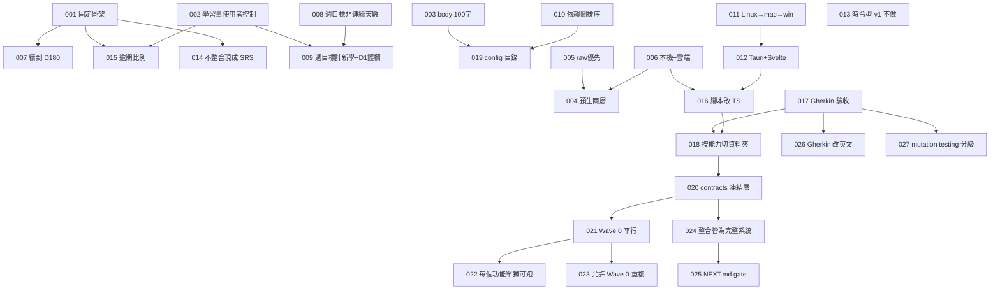

# Decision Map

所有有取捨的決定,ADR 格式,只增不刪。被推翻的標 `superseded`,不刪除——
決策地圖的價值就在於看得到「當初為什麼這樣想、後來為什麼改」。

新增用 `/decide`。

## 怎麼讀

- **Status**:`accepted` 生效 / `superseded by ADR-XXX` 被推翻 / `proposed` 待確認
- **Context** 當時的情況與限制 · **Decision** 決定了什麼 · **Alternatives** 沒選的
- **Consequences** 好處與代價 · **Related** 相關 ADR 與 feature

## 依賴圖



---

## ADR-001 · 排程用固定骨架,不用自適應演算法

- **Status**: accepted · 2026-09-02
- **Context**: 使用者要求考「昨天、一週前、一個月前」,要可預期。FSRS 效果更好但間隔由模型決定,使用者無法預知今天考什麼。
- **Decision**: D1 / D7 / D30 為骨架,答錯退回 D1,連錯觸發重教。排程層為純函式獨立模組。
- **Alternatives**: FSRS 自適應;純固定無回退。
- **Consequences**: 可預期、零依賴、實作簡單。記憶效率略低於 FSRS。排程層可替換。
- **Related**: ADR-007, 014, 015, features/04-scheduler

## ADR-002 · 每日學習量由使用者控制

- **Status**: accepted · 2026-09-02
- **Context**: 原提案每天固定 N 個。使用者要主動權與三個按鈕。
- **Decision**: 教學卡是拉式,無每日上限。只顯示「今天已學 N,明天約 M 題」。
- **Alternatives**: 固定 N=1/2/3。
- **Consequences**: 考試量不可預測,因此需要每日題數上限(015)與週目標護欄(009)。
- **Related**: ADR-009, 015, features/07-teach-card

## ADR-003 · body 上限 100 字,範例圍欄不計

- **Status**: accepted · 2026-09-02
- **Context**: 使用者要「不要讓大腦學太多」,但範例需要空間。
- **Decision**: body ≤ 100(CJK 每字 1、非 CJK 連續序列 1、標點 0)。example 圍欄不計不限,可放圖。程式硬檢查。
- **Alternatives**: 200 / 300 字;範例也計。
- **Consequences**: 生成需重試機制;渲染需自訂 fence 插件。
- **Related**: contracts §2, features/01, 02, 07

## ADR-004 · 深入內容:預生 level 0–1,level 2+ 即時

- **Status**: accepted · 2026-09-02
- **Decision**: ingest 時產 level 0 與 1。level 2+ 按了才生,線上雲端、離線本機並標 provisional。
- **Alternatives**: 全預生;全即時。
- **Consequences**: 九成使用離線可用;需要 provisional 機制。
- **Related**: ADR-005, 006, features/07 phase-3

## ADR-005 · 內容來源 raw 優先,無 raw 才 LLM

- **Status**: accepted · 2026-09-02
- **Context**: 只用 raw 覆蓋率不足;只用 LLM 可信度不足,尤其資安。
- **Decision**: 有 raw 從 raw 產生並帶 source_ref;無 raw 由 LLM 依主題。每張卡帶 source。類別級 `require_raw` 可強制寧缺勿假。
- **Related**: ADR-019, features/02 phase-3

## ADR-006 · LLM 本機與雲端都要,依任務路由

- **Status**: accepted · 2026-09-02
- **Decision**: 單一 `call(task, prompt)` 介面,路由表決定 provider。生成類離線即拒絕;審核與深入可降級並標 provisional。
- **Related**: ADR-004, 016, contracts §7, features/03

## ADR-007 · D30 後繼續 D90、D180,再歸檔

- **Status**: accepted · 2026-09-02
- **Decision**: 五個檢查點,通過 D180 歸檔。
- **Consequences**: 穩態每日題數 ≈ 每日新學 × 5。配合上限 10,長期節奏約每天 2 個新概念。
- **Related**: ADR-001, 015

## ADR-008 · 遊戲化用週目標,不用連續天數

- **Status**: accepted · 2026-09-02
- **Context**: 連續天數有「斷一天就放棄」的已知失敗模式。
- **Decision**: 每週目標,達標即可,週一歸零,無懲罰。
- **Related**: ADR-009, features/08

## ADR-009 · 週目標計新學數,但須通過 D1

- **Status**: accepted · 2026-09-02
- **Context**: 使用者選新學數。設計者指出風險:猛按二十張、隔天考不完、下週歸零。
- **Decision**: 計數以「本週通過 D1 的卡片數」為準。滑過不算。
- **Consequences**: 護欄是設計者加的,使用者可拿掉。計數延後一天反映。
- **Related**: ADR-002, 008

## ADR-010 · 教學順序依 LLM 建立的依賴圖拓樸排序

- **Status**: accepted · 2026-09-02
- **Decision**: ingest 時標 prereqs、建圖、拓樸排序。軟性順序,不阻擋跳學,只顯示先備提示。
- **Consequences**: 需循環偵測;LLM 判斷可能出錯,lint 要能查。
- **Related**: ADR-019, features/01 phase-3, features/07 phase-2

## ADR-011 · 平台順序 Linux → macOS → Windows

- **Status**: accepted · 2026-09-02
- **Consequences**: Wayland 置頂限制需偵測並提示。
- **Related**: ADR-012, features/10

## ADR-012 · 桌面框架用 Tauri 2 + Svelte 5

- **Status**: accepted · 2026-09-02
- **Context**: 需要輕量常駐視窗、系統列、跨平台。使用者授權設計者決定。
- **Alternatives**: Electron。
- **Consequences**: 需 Rust toolchain;體積小、記憶體低;跨平台成本低。
- **Related**: ADR-011, 016

## ADR-013 · 時令型內容 v1 不做

- **Status**: accepted · 2026-09-02
- **Context**: 桃樹管理等季節驅動知識不符合間隔重複模型。
- **Decision**: v1 只做記憶型。時令型留 v2,需要日曆驅動的卡片型別。

## ADR-014 · 不整合現成 SRS 專案,只借概念

- **Status**: accepted · 2026-09-02
- **Context**: 使用者原想把多個開源專案放同一資料夾接線。Anki / SiYuan / Logseq 資料模型與執行環境各異,整合等於重寫。
- **Decision**: 自建。因選固定骨架(001),連 FSRS 函式庫也不需要。
- **Related**: ADR-001

## ADR-015 · 每日上限 10 題,優先序用逾期比例

- **Status**: accepted · 2026-09-02
- **Context**: 原提案「先考到期最久的」被設計者自我修正:D1 晚一天是逾期 100%,D180 晚一天是 0.5%。
- **Decision**: 每日 ≤ 10(可調);優先序 = 逾期天數 ÷ 該 stage 間隔。
- **Related**: ADR-001, 002, 007

## ADR-016 · 腳本改用 TypeScript

- **Status**: accepted · 2026-09-02 · 修正 00-design.md §8
- **Context**: 設計文件寫 Python。但 llm-router 桌面端是 TS,腳本用 Python 就要兩份路由。
- **Decision**: 所有非 Rust 程式碼用 TypeScript,核心放 `packages/core` 共用,腳本用 tsx。
- **Consequences**: 單一語言、單一路由、單一型別。放棄 Python 生態,改用 zod。
- **Related**: ADR-006, 012, 018

## ADR-017 · 用 Gherkin 當驗收規格與測試

- **Status**: accepted · 2026-09-02
- **Decision**: 每個 phase 一個 `.feature`,cucumber 執行。`@manual` 由人確認。沒有 gherkin 不開工。
- **Related**: ADR-018, 026, 027

## ADR-018 · features/ 按能力切,不按里程碑切

- **Status**: accepted · 2026-09-02
- **Context**: 一個能力橫跨多個階段;按階段切會讓同一能力的 gherkin 散落。
- **Decision**: 一個能力一個資料夾,內含多個 phase。roadmap 負責對應到 wave / integration。
- **Related**: ADR-016, 017, 020

## ADR-019 · 新增 config/ 目錄

- **Status**: accepted · 2026-09-02 · 補充 00-design.md §3.1
- **Decision**: `config/categories.yaml` 與 `config/settings.yaml`。
- **Related**: ADR-005, 009, 015

## ADR-020 · 新增 contracts/ 凍結層

- **Status**: accepted · 2026-09-02
- **Context**: 使用者要求「一開始各個資料夾第一階段完全能平行實做」。平行的唯一障礙是「A 需要 B 的型別才能動」。
- **Decision**: 抽出 `contracts/`:所有跨模組型別、檔案格式、函式簽章、路由表、fixture 規範。Wave 0 開始後凍結,修改需 ADR 並列出要重驗的 phase。
- **Alternatives**: 讓 01-data-layer 先做完當前置(那樣就沒有平行);每個模組自己定義介面,整合時協調(整合會撞成一團)。
- **Consequences**: 多一層要維護。改契約成本高——這是刻意的。換來十個資料夾真正平行。
- **Related**: ADR-018, 021, contracts/

## ADR-021 · Wave 0:十個 phase-1 完全平行,禁止跨資料夾 import

- **Status**: accepted · 2026-09-02
- **Context**: 使用者要求第一階段完全平行。
- **Decision**: 每個資料夾的 phase-1 只能 import `contracts/` 與自己的目錄。需要別人的能力就用 contract 介面 + 自己的 stub。這條由 `/phase-done` 檢查。
- **Alternatives**: 允許依賴但排順序(那不是平行);只讓部分資料夾平行(複雜度不減、好處減半)。
- **Consequences**: 十個資料夾可同時開工。代價是 Wave 0 有重複(見 023)。
- **Related**: ADR-020, 022, 023

## ADR-022 · 每個功能必須能單獨執行,整合後仍然要能

- **Status**: accepted · 2026-09-02
- **Context**: 使用者要求「每個資料夾內的功能也能單獨運行」。
- **Decision**: 每個 `FEATURE.md` 有「單獨執行」段落,寫一行可複製的指令。`/phase-done` 實際執行它。整合後仍須能跑——這是刻意的耦合約束。
- **Alternatives**: 只在 Wave 0 要求(那整合後模組會慢慢黏死)。
- **Consequences**: 每個模組要有 CLI 或 dev server 入口,是額外工作。換來的是模組永遠可以單獨 debug,以及一個永遠有效的耦合檢測器。
- **Related**: ADR-021

## ADR-023 · 接受 Wave 0 的重複,整合時移除

- **Status**: accepted · 2026-09-02
- **Context**: 平行的代價是幾份 FakeLlmRouter、幾個最小驗證器。
- **Decision**: 接受。每個 `FEATURE.md` 有「Wave 0 的重複」表,列出東西、位置、在哪個整合點移除。`/integrate` 逐一檢查。
- **Alternatives**: 為了避免重複而排順序(等於放棄平行)。
- **Consequences**: 一點重複遠比一個依賴鏈便宜。額外好處:09-lint 的獨立驗證器與 01 的驗證器可以互相對照,結論不同就代表契約有歧義——這是只有在有兩份獨立實作時才做得到的檢查。
- **Related**: ADR-021, features/09 NEXT.md

## ADR-024 · 每個整合點都必須是完整可用的系統

- **Status**: accepted · 2026-09-02
- **Context**: 使用者要求「每一次整合就是一個完整可用的系統」。
- **Decision**: 八個整合點,每個的驗收 gherkin 都必須有至少一個 `@e2e` 場景描述「一個人從頭到尾做完一件有意義的事」。寫不出來就代表切錯了,重切。每個整合檔另有 `@regression` 場景驗證前一個整合點沒被弄壞。
- **Alternatives**: 按技術層次整合(先全部後端再全部前端)——那樣中間好幾個月沒有可用的東西。
- **Consequences**: I2 之後系統就有價值。專案在任何整合點停下來,手上都有能用的東西。代價是整合點的切法受限,不能純粹按技術方便切。
- **Related**: ADR-025, docs/integration/

## ADR-025 · 每個資料夾用 NEXT.md 管理 gate

- **Status**: accepted · 2026-09-02
- **Context**: 使用者要求「每個資料夾內也要有文檔指揮 AI 何時進行下一步的 gherkin 開發」。
- **Decision**: 每個資料夾一個 `NEXT.md`:目前狀態、下一個 phase 的 gate(自身 / 整合 / 契約三類)、gate 未滿足時該做什麼、完成後解鎖什麼。`/sprint` 讀它決定 ready,不手動改狀態。
- **Alternatives**: 只在 roadmap 集中管理(AI 在資料夾內工作時看不到);只靠 FEATURE.md 的依賴表(說得出「等什麼」但說不出「現在該做什麼」)。
- **Consequences**: 「gate 未滿足時該做什麼」是最有價值的段落——它防止 AI 在等待時瞎猜介面、寫出要重寫的程式。
- **Related**: ADR-024

## ADR-026 · Gherkin 用英文,文件用中文

- **Status**: accepted · 2026-09-02 · 修正 ADR-017 的語言選擇
- **Context**: 使用者要求 gherkin 全英文。
- **Decision**: 所有 `.feature` 用英文(cucumber 預設語言,無需 language 標頭)。`docs/`、`FEATURE.md`、`NEXT.md`、commands、skill 用繁體中文。
- **Alternatives**: 全中文(zh-TW,cucumber 原生支援);混用。
- **Consequences**: 步驟定義的字串是英文,與程式碼一致。中文的說明性文件保留在需要細膩表達的地方。
- **Related**: ADR-017

## ADR-027 · 導入 mutation testing 並分三級門檻

- **Status**: accepted · 2026-09-02
- **Context**: 使用者要求加入 mutation testing。這個專案的核心是排程邏輯,算錯要幾週後才發現,行覆蓋率抓不到。
- **Decision**: 用 Stryker。三級門檻:嚴格 95%(scheduler、grading 前兩層、字數與驗證器、weekly 計數、路徑防護)、標準 80%(ingest、lint、路由決策)、寬鬆不強制(adapter、CLI、UI 元件)。`/phase-done` 前必跑。技能檔 `.claude/skills/mutation-testing/`。
- **Alternatives**: 只用行覆蓋率(抓不到「執行到但沒驗證」);全專案統一門檻(UI 追高分沒有意義,會浪費時間)。
- **Consequences**: 驗收變慢。換來排程與審核邏輯的信心。明確禁止「為衝分數寫斷言」——那會在重構時變成阻力。
- **Related**: ADR-017, .claude/skills/mutation-testing/

## ADR-028 · 組合層不參與 Wave 0

- **Status**: accepted · 2026-09-02
- **Context**: v2 漏了一個交付物:整合 gherkin 到處寫 "the review command",但沒有任何 feature 資料夾產出它。04 是純函式、05 是審核、06 是 UI,沒有人負責把它們串起來。
- **Decision**: 新增 `11-review-cli`,phase-1 在 I2。它**不參與 Wave 0**——組合層在被組合的東西存在之前無法獨立,硬造一個吃 stub 的版本等於寫兩次。這是 ADR-021 的明確例外。
- **Alternatives**: 把 CLI 塞進 04 或 05(職責不對);讓它有一個吃 stub 的 Wave 0 版本(重工)。
- **Consequences**: Wave 0 是十一個 phase 不是十二個。`11-review-cli` 同時是 `06-test-card` 的行為規格來源——CLI 先定案,UI 只是換皮。
- **Related**: ADR-021, features/11-review-cli

## ADR-029 · 契約分硬約定與軟約定

- **Status**: accepted · 2026-09-02 · 修正 ADR-020
- **Context**: v1.0 把整份契約都凍死。但 TypeScript 型別改了編譯器會抓、測試會抓,走 ADR 是儀式不是保護。使用者也反映「不要約束太緊」。
- **Decision**: **硬約定**(磁碟格式 §2 §3 §4 §8–§12,加 §7 的 `LlmTask` 與路由表)改動需 ADR。**軟約定**(記憶體介面 §5 §6 §13、§7 的函式簽章)改了跑測試、更新文件、commit 說明理由即可。
- **Alternatives**: 全凍(太重);全不凍(AI 跨 session 會漂移)。
- **Consequences**: 改函式簽章不再是一場儀式。磁碟格式仍然受保護,因為改了會讓已產生的資料失效。契約升版至 1.1.0。
- **Related**: ADR-020, contracts/README.md

## ADR-030 · 只有嚴格級的變異門檻是硬性的

- **Status**: accepted · 2026-09-02 · 修正 ADR-027
- **Context**: v2 讓 `/phase-done` 在任何門檻未達時都擋住。對 UI 與 adapter 來說這是浪費時間。
- **Decision**: **嚴格級(95%)未達 → 擋住**,因為那些模組算錯的代價是延遲數週才顯現。**標準級(80%)未達 → 回報但不擋**,由你決定要不要處理。**寬鬆級 → 不跑。**
- **Alternatives**: 全部硬性(拖慢);全部軟性(排程邏輯會鬆掉)。
- **Consequences**: 驗收變快。代價是標準級模組的測試品質靠自律。這個取捨是刻意的:嚴格級涵蓋了所有「錯了會靜默」的地方。
- **Related**: ADR-027

## ADR-031 · 流程分核心與選配,可以只用核心

- **Status**: accepted · 2026-09-02
- **Context**: 一百多個檔案的流程對一個人來說偏重。使用者要求「不要約束太緊」。
- **Decision**: 明確區分**核心**(契約、gherkin、`/phase-done` 的測試與單獨執行檢查)與**選配**(sprint 檔、`/integrate` 的完整清單、decision map 的 mermaid 圖、變異測試的標準級)。`03-agile-workflow.md` 新增「最小模式」段落說明只用核心怎麼跑。
- **Alternatives**: 全部必做(會被放棄);刪掉選配的部分(專案長大時會後悔)。
- **Consequences**: 流程是為了保護你不犯已知的錯,不是為了被遵守而存在。用不到就關掉,需要時再開。
- **Related**: ADR-025, docs/03-agile-workflow.md

## ADR-032 · prompt 改動需要 golden run

- **Status**: accepted · 2026-09-02
- **Context**: `packages/core/prompts/` 決定卡片、考題、審核的品質,但它不是程式,型別檢查與單元測試都抓不到。LLM 產品最常見的靜默退化就是改了 prompt、品質下降、幾週後才發現。
- **Decision**: 新增 `12-prompt-quality`。每個 prompt 任務有固定的 golden 輸入;改 prompt 要跑一次 live golden run 並與基準比對;人打分數(兩個維度各 1–5)。工具**不判斷品質**,只讓變化被看見。另有結構性自動檢查(字數、JSON 合法、rubric 條數)。
- **Alternatives**: 不做(唯一會靜默毀掉品質的洞);用 LLM 自動評分(評分者跟被評者同源,信不過)。
- **Consequences**: 改 prompt 多一道手續。`CLAUDE.md` 加一條:改了 prompt 沒跑 golden 就 commit,是這個專案唯一會靜默毀掉品質的操作。
- **Related**: features/12-prompt-quality

## ADR-033 · cucumber 用 tsx 的 ESM loader 載入 TypeScript

- **Status**: accepted · 2026-09-02
- **Context**: `@cucumber/cucumber` 11 + `"type": "module"`,步驟檔是 TypeScript。載入方式有 ts-node、tsx、先編譯三種,而這件事擋住所有自動驗收。
- **Decision**: `package.json` 的三個 `accept*` 腳本前綴 `NODE_OPTIONS=--import=tsx`;`cucumber.js` 維持 `import: ['features/steps/**/*.ts']`。步驟檔之間互相 import 寫 `./_world.js`(ESM 慣例,tsx 對應到 `.ts`)。
- **Alternatives**: ts-node/esm(維護慢、ESM 支援不穩);先 `tsc` 再跑(多一步,而且 vitest 與 scripts 已經都走 tsx)。
- **Consequences**: 整個 repo 的 TypeScript 執行只有一條路(tsx)。Windows(I8)要把 `NODE_OPTIONS=` 前綴改成 `cross-env`,到時再處理。**注意 `cucumber.js` 本身的格式**:`export default` 本身就是 default profile 的內容,不能再包一層 `default: {...}`——包了會讓 `@cucumber/cucumber` 11 安靜退回內建預設,`import` 完全不會發生,所有 step 變成 undefined,看起來像「還沒實作」而不是設定錯了。Wave 0 scaffold 時埋了這個坑,多個 worker 各自撞見,詳見 ADR-036。
- **Related**: ADR-016, ADR-017, ADR-036, features/steps/README.md

## ADR-034 · 雲端 provider 用 OpenAI,模型名只從環境變數來

- **Status**: accepted · 2026-09-02
- **Context**: 待決表的「雲端 provider 與模型」擋著 03-llm-router/phase-1 的 `@llm` 場景。使用者決定用 OpenAI,金鑰在 `.env`(`OPENAI_API_KEY`,已 gitignore),模型名 `gpt-5.6-luna`(協調者已用 API 驗證存在)。
- **Decision**: provider 與模型名不寫死在程式碼。依契約 §11 從 `LLM_CLOUD_PROVIDER` / `LLM_CLOUD_MODEL` 讀,其次 `settings.llm`。`.env.example` 記錄變數名與目前值;只有 CLI 入口用 `process.loadEnvFile` 載入 `.env`,library 只讀 `process.env`。OpenAI adapter 用 `max_completion_tokens`(該模型不接受 `max_tokens`)。
- **Alternatives**: 寫死模型名(換模型要改程式);同時做 Anthropic adapter 的真呼叫(契約保留 `anthropic` 值,adapter 要有,但 Wave 0 只有 OpenAI 有金鑰,Anthropic 走 mock)。
- **Consequences**: 換模型只改 `.env`。`contracts/fixtures/learning-minimal/config/settings.yaml` 仍寫 anthropic 當範例,環境變數會覆蓋它。
- **Related**: ADR-006, contracts/types.md §7 §11, features/03-llm-router/FEATURE.md

## ADR-035 · Wave 0 平行開發的落點與共用檔歸屬

- **Status**: accepted · 2026-09-02
- **Context**: 使用者決定打破 WIP ≤ 2,十一個 phase-1 各開一個 git worktree 同時做。互踩只會發生在共用檔與同一個目錄,所以要在分叉前定好。
- **Decision**:
  1. 落點表在 `packages/core/README.md`,`scripts/check-boundaries.ts` 的 `OWNERS` 是同一份表的程式版。每個功能一個 `packages/core/src/<name>/`(含自己的 stub),UI 在 `apps/<name>/`。
  2. `packages/ui-shared/`(example 圍欄插件)Wave 0 由 07-teach-card 擁有;06-test-card 在 I3 前不 import 它。
  3. 共用檔只有協調者改:`package.json`、lock、`tsconfig.json`、`cucumber.js`、`standalone.json`、`features/steps/_world.ts`、`features/steps/common.steps.ts`、`docs/01-roadmap.md`、本檔。worker 把需求寫在自己 FEATURE.md 的「待協調」段。
  4. 出現在兩個以上資料夾的 gherkin 句子只在 `common.steps.ts` 定義一次;只用在 `@manual` 場景的句子不定義。
  5. 所有依賴一次裝在 root(workspaces hoisting),worktree 只跑 `npm ci`,不動 lock。
  6. 合併順序:01 先,再 04,其餘隨到隨合;每次合併後跑 `boundaries`、`test`、`accept:standalone`、`standalone`。
- **Alternatives**: 各 worktree 自己加依賴與 workspace(lock 必衝);允許 06 與 07 同時寫 ui-shared(同檔互踩)。
- **Consequences**: worker 的自由度小一點,但合併幾乎不會衝突。`CLAUDE.md` 的「WIP ≤ 2」在 Wave 0 暫時不適用,Wave 0 之後恢復。
- **Related**: ADR-021, ADR-022, ADR-023, packages/core/README.md, scripts/check-boundaries.ts

## ADR-036 · cucumber.js 設定檔格式修正、standalone 指令的預期退出碼

- **Status**: accepted · 2026-09-02
- **Context**: Wave 0 十一個 phase-1 平行開發期間,四個獨立 worker(01、03、04、08,後續 09、10、12 也各自回報同一件事)分別發現 `cucumber.js` 的 `export default { default: {...} }` 巢狀寫法在 `@cucumber/cucumber` 11 + `package.json` `"type":"module"` 下不會被正確解析——ESM `await import()` 讀到的是 `{ default: <export default 的值> }`,程式只在該值是 function 時才展開,object 時直接當設定物件用,於是 `paths`/`import`/`tags` 全部讀不到,`npm run accept*` 對全 repo 每個功能都回報所有 step undefined。ADR-033 決定了 loader 機制(tsx + `--import`),但沒發現這個設定檔本身的格式錯誤,一路帶到 Wave 0 平行開發才被多個 worker 各自撞見。另外,09-lint 的單獨執行指令設計上就該回傳非 0(找到問題就是要失敗),但 `scripts/check-standalone.ts` 原本一律要求退出碼 0。
- **Decision**:
  1. `cucumber.js` 的 `export default` 直接就是 default profile 的內容,不再包一層 `default: {...}`;移除已棄用的 `publishQuiet`。額外 profile 要用具名 export(例如 `export const ci = {...}`),不要塞進這個物件。
  2. `standalone.json` 的每個項目可以加 `expectExit`(選填,預設 0),`scripts/check-standalone.ts` 用它比對退出碼而不是寫死要求 0。`09-lint` 設成 1。
- **Alternatives**: 針對 09-lint 在 `check-standalone.ts` 特殊判斷資料夾名稱(硬編碼例外,難維護);cucumber.js 改用具名 export 取代 `export default`(要同步改 `package.json` 的 `--profile` 參數,改動面更大)。
- **Consequences**: 這個 bug 存在期間,所有 worker 的 `npm run accept:standalone` 都是假失敗,只能用 `NODE_OPTIONS=--import=tsx npx cucumber-js --import 'features/steps/**/*.ts'` 繞過驗證——這件事後續被 phase-acceptance 拿來當「不要照抄範例設定檔,要跑得動才算數」的教訓。順帶在收尾複查時發現 `packages/core/src/llm/router.ts`(FEATURE.md 標嚴格 95%)合併時變異測試只有 52.54%,審核階段沒人針對它單獨重跑 Stryker——之後嚴格級模組的審核要明確在報告裡點名每一個「檔案級」嚴格門檻,不能只看整個目錄的總分。
- **Related**: ADR-033, ADR-035, packages/core/README.md, features/*/FEATURE.md 的「待協調」段

## ADR-037 · 本機模型延後,不是 v1 就要做

- **Status**: 部分 superseded by ADR-039 · 2026-09-04(gate「使用者決定裝本機模型」已解除:模型由另一台機器的 Ollama + JWT 閘道提供。「不在這台機器的 GTX 1650 上跑本機模型」這個理由仍然成立,契約 §7 的降級路徑也沒有改。)· 原 accepted · 2026-09-03
- **Context**: 待決表的「本機模型與硬體」擋著 03-llm-router/phase-2 的本機 adapter。機器實測:`ollama` 已安裝但沒在跑、`~/.ollama/models` 是空的(12K)、GPU 是 GTX 1650(**4GB VRAM**)、RAM 31GB。14B(Q4 約 9GB)塞不進 GPU 會大半跑 CPU、很慢;7B(約 4.7GB)部分 offload 可用但應用審核能力有限;3B 全進 GPU 快但更弱。使用者決定**先跳過本機模型,不是永久不做**——確認過契約 §7 的路由表本來就定義了「離線+無本機」這個分支(`ingest.*`、`deepen`、`grade.apply`、`reteach.short` 丟 `NO_MODEL`/`CLOUD_REQUIRED`,`grade.fill.llm` 丟 `NO_MODEL`),§5 的 `fallback-strict` grader 就是給填空第三層沒本機模型時走的,所以「跳過本機」等於系統長期停在 `probeLocal()` 回傳 `{ available: false, models: [] }` 這個契約已經定義好的狀態,不需要改硬約定。
- **Decision**: 本機模型延到 I6 或之後,gate 是「使用者決定要裝哪個模型、什麼時候裝」,不是技術上做不到。落實:
  1. `03-llm-router/phase-2` 範圍收斂成:路由表(契約 §7)+ 雲端 adapter(已在 phase-1 做完)+ 上線偵測 + `probeLocal` 固定回 `{ available: false, models: [] }`。這部分嚴格 95% 門檻不變,要測滿。
  2. 本機 adapter(真的呼叫 ollama HTTP API)與所有「本機模型可用」的場景,搬到 `03-llm-router` 的新 phase(phase-4,phase-3 保留給 ADR 之前規劃的 provisional 佇列,兩者都掛在「使用者決定裝本機模型」這個 gate 下)。FEATURE.md 標 `todo`,NEXT.md 契約 gate 寫清楚。
  3. `05-grading/phase-3`(離線審核)與 I6 涉及本機推論的那一半,gate 同上,一併延後。I1–I5 的其餘 phase 不受影響,照原計畫走。
- **Alternatives**: 現在就裝 7B 湊合用(使用者評估 4GB VRAM 效果不夠好,不值得為了湊 v1 而用一個體驗差的本機模型);永久砍掉本機模型只留雲端(使用者明確表示是延後不是砍,保留 §7 路由表與 fallback-strict 設計讓之後隨時能補)。
- **Consequences**: 離線時(no wifi/沒網路)應用審核與深入生成不可用、填空第三層固定走 fallback-strict,這是契約本來就設計好的降級路徑,不是新缺口。03-llm-router/phase-2 的契約 gate 解除,可以立刻跟 01-data-layer/phase-3 平行開工。I6(長期維護、provisional 複審)在使用者真的裝本機模型前,價值會打折扣,到時候再評估要不要調整範圍。
- **Related**: ADR-034, **ADR-039**, contracts/types.md §5 §7, features/03-llm-router/NEXT.md, features/03-llm-router/FEATURE.md

## ADR-039 · 本機模型透過閘道提供,解除 ADR-037 的 gate

- **Status**: accepted · 2026-09-04
- **Context**: ADR-037 把本機模型延後,gate 是「使用者決定要裝哪個模型、什麼時候裝」,理由是這台機器只有 GTX 1650 4GB VRAM,塞得進去的模型太弱。現在使用者提供了另一條路:**另一台機器**跑 Ollama(`qwen2.5:32b`、`deepseek-r1:70b`),前面一個 JWT 閘道,所以模型不在本機 GPU 上,但對這個專案來說就是契約 §7 的「本機」那一欄。閘道協定(使用者提供,已確認):
  - `POST {BASE}/auth/token/exchange`,header `Authorization: Bearer <明文 key>` → `{ access_token }`(短期 JWT)
  - `GET {BASE}/gateway/models`(Bearer token)→ `{ auto_match, models: { <name>: [...] } }`,`models` 的 key 就是可用模型名
  - `POST {BASE}/gateway/chat`,body `{ prompt, model, service }` → `{ content, provider: "ollama", model, tokens_used, ... }`
  - `/gateway/chat/stream` 是 SSE(這個 phase 不用,先只走非串流)
  - **`model` 只能填本機模型名**,填雲端模型名或 `"auto"` 會回 **403**
  - 免費(使用者自己的硬體),沒有 token 成本
  - 設定:`GATEWAY_BASE_URL`(先 `http://localhost:8787`,之後換成網域)、`GATEWAY_API_KEY`、`LLM_LOCAL_MODEL`(預設 `qwen2.5:32b`)

  同時要解決的是相反方向的問題:雲端(OpenAI)是唯一會花錢的一邊,目前沒有任何花費上限,一個跑掉的迴圈可以在無人看管時燒掉很多錢。閘道免費,所以「預算用完就改走閘道」是自然的煞車。

- **Decision**:
  1. **閘道就是契約 §7 的「本機」,不改契約。** 閘道 adapter 回傳的 `LlmResult.provider = 'ollama'`(閘道自己回報的就是這個值),`model` 是 `LLM_LOCAL_MODEL`。`probeLocal()` 的實作改成:換 token → `GET /gateway/models`,回 `{ available, models }`。token 快取到過期前重用(回應有 `expires_in` / `expires_at` 就用它,沒有就當 50 分鐘),過期才重換。401(key 錯)與連線失敗都回 `{ available: false, models: [] }`,**不 throw**——沿用 phase-2「本機模型不在不是錯誤」的行為。
  2. **路由:契約 §7 的表一格都不動**,只在「在線」這一欄之上多一層**備援規則**(規則本身記在 `features/03-llm-router/FEATURE.md`):
     - `grade.fill.llm` 一律走閘道——契約本來就寫 local,不是新規則,只是現在真的有 local 了。`provisional = false`(填空審核本來就該由本機做,不算暫定結果)。
     - `deepen` / `grade.apply` / `reteach.short`:在線走 OpenAI;**OpenAI 失敗(5xx / 逾時 / 截斷重試後仍失敗)或當日預算用完 → 改走閘道,`provisional = true`**,進 I6 的複審佇列(phase-3)。
     - `ingest.cards` / `ingest.questions` / `ingest.deps`:**只走 OpenAI,沒有備援**,失敗就 `CLOUD_REQUIRED`;預算用完就 `BUDGET_EXCEEDED`(拒絕開始,印「今日預算已用完」)。使用者明確選的:卡片品質還沒用本機模型驗過,不讓它產卡。
  3. **當日預算**:`LLM_DAILY_CAP_USD`(預設 1 美元)。花費從 `state/log.jsonl` 的 `llm_call` 事件算——只算 `provider === 'openai'` 且 `ts` 落在當日的事件,`tokens_in` / `tokens_out` 乘上 `LLM_PRICE_IN_PER_M` / `LLM_PRICE_OUT_PER_M`(每百萬 token 的美元價)。閘道的呼叫(`provider === 'ollama'`)不計入,因為免費。
  4. **「剛好等於上限」算已達上限**(`spent >= cap`,不是 `>`)。理由:(a) 上限是天花板,不是配額目標;下一次呼叫必然超過它。(b) log 算出來的數字本質上是**低估**——正在進行中、還沒寫 log 的那一次呼叫不在裡面,浮點乘法也可能少一點點。錢的方向上保守比較安全。(c) `>=` 是單一比較,沒有 off-by-one 的解讀空間,測試邊界只有一個點。這個判斷寫成 `spend.ts` 的 `isBudgetExhausted()`,兩邊(router 備援與 `scripts/llm-spend.ts` 的退出碼)共用同一個函式,不會各寫一份而不一致。
  5. **落點**:備援規則與預算計算**不放進 `routing.ts`**,各自獨立成 `packages/core/src/llm/fallback.ts` 與 `spend.ts`——比照 `token-limits.ts` 刻意不併進 `routing.ts` 的做法(ADR-036 的教訓),避免動到 `routing.ts` 既有的嚴格 95% 變異門檻。閘道客戶端在 `packages/core/src/llm/gateway.ts`,把三者串起來的 router 在 `router-gateway.ts`(組合既有的 `LlmRouterImpl`,不改它一行,跟 phase-2 包 phase-1 的做法一致)。另外新增 `scripts/llm-spend.ts --today`,印出今日金額與筆數,**退出碼 1 表示已達上限**,給 autopilot 在花錢前先問一句用。
  6. **閘道還沒起來**(8787 無回應、key 未進 `.env`),所以 phase-4 的 `@llm` 場景先用 mock 閘道(照 `features/steps/_fake-cloud.mjs` 的模式:只換掉 `globalThis.fetch`,router / adapter 全跑真的),真連線的場景標 `@manual`,等使用者起閘道再跑。

- **Alternatives**:
  - **閘道只當純備援,不做 `grade.fill.llm` 的填空審核** → 契約 §7 明寫 `grade.fill.llm` 走 local,而且填空審核量大、又是免費資源,不用等於浪費。
  - **`ingest.*` 也備援到閘道** → 使用者明確拒絕。卡片是幾個月要看的東西,本機模型產卡的品質還沒有 golden run 驗過,寧可失敗也不要靜默降級成品質未知的卡。
  - **把閘道當第四種 provider 值(例如 `'gateway'`)** → 要改契約 §7 的 `LlmResult.provider` 硬約定。沒必要:閘道回報的就是 `ollama`,而且對呼叫端來說「這是本機模型的結果」才是它要知道的事,不是「經過哪一台代理」。
  - **預算用完就整個停下來(連 `deepen` 也不做)** → 太粗暴。免費的閘道就在那裡,`provisional = true` + I6 複審佇列本來就是為了這種「先用著、之後再校對」的情況設計的。
  - **花費另外存一份 counter 檔** → `log.jsonl` 已經有 `llm_call` 事件帶 `tokens_in`/`tokens_out`(契約 §10),再存一份就有兩個真相來源,而且 counter 檔要處理原子寫入與跨日重置。從 log 算是純函式,好測。

- **Consequences**:
  - **ADR-037 的 gate 解除** → `03-llm-router/phase-3`(provisional 佇列)與 `phase-4` 的契約 gate 打勾;`05-grading/phase-3` 與 I6 的離線那一半也一併解開。ADR-037 標 **部分 superseded**:「使用者決定裝本機模型」這個 gate 沒了,但「不在這台機器的 GTX 1650 上跑本機模型」這個理由仍然成立——模型跑在另一台機器上。
  - `03-llm-router/phase-4` 的標題改成「**閘道本機 adapter + 預算備援**」,範圍比原本的「本機 adapter」大(多了預算與備援)。
  - 離線(連不到閘道也連不到 OpenAI)的行為完全不變,還是契約 §7 那張表——閘道只是讓「有 local」這一欄第一次真的會發生。
  - 多了三個環境變數要設(`GATEWAY_BASE_URL` / `GATEWAY_API_KEY` / `LLM_DAILY_CAP_USD` 那組價格),`.env.example` 已經記錄。價格是手填的,方案改價沒人會提醒——預算會算錯,但方向可控,而且 `scripts/llm-spend.ts` 印得出來可以對帳。
  - 閘道在另一台機器上,所以「本機」的可用性從此取決於網路與那台機器有沒有開,不是這台機器的 GPU。`probeLocal()` 的逾時要短(當可用性檢查用),不能用雲端那個 60 秒。

- **Related**: ADR-034, ADR-036, ADR-037, `contracts/types.md` §7 §11, `features/03-llm-router/FEATURE.md`, `features/03-llm-router/NEXT.md`

## ADR-038 · 依賴圖丟邊達上限時,移除該分類的過期圖資料

- **Status**: accepted · 2026-09-04
- **Context**: ADR 之前的一輪把「模型回應有循環」改成本地丟邊修復(見 `packages/core/src/ingest/deps.ts` 的 `removeCyclesLocally()`):丟邊丟到無環為止,丟邊次數達上限(`cards.length`)仍有循環就 **`graph/deps.json` 與 `graph/order-<category>.json` 都不寫**,維持契約 §8「要嘛都寫、要嘛都不寫」的不變量。但 early return 只保證「**這一次**不寫」。如果上一次成功的 run 已經寫過檔,舊的 entry 與舊的 order 檔還留在磁碟上,讀的人拿到的是**過期的圖卻完全看不出來**——這跟剛修掉的「考題生成靜默失敗」是同一類洞。查過 09-lint 目前有哪些檢查(`contracts/fixtures/learning-broken/EXPECTED.md` 與 `features/09-lint/phase-1.feature`),**沒有**「卡片不在 order 裡」這一條,零筆,所以「留著舊檔 + 標記讓讀的人自己判斷」在現階段等於沒有人會判斷。
- **Decision**: 丟邊達上限仍有循環時,除了原本就要記的那筆 `warning`(含殘留循環路徑)之外,**移除該分類的過期圖資料**。粒度是**分類**,不是整個檔:
  1. 契約 §8 的 `graph/deps.json` 型別是 `Record<CategoryId, Graph>`,**一個檔裝所有分類**。所以要讀進整個檔、**只刪掉該分類的 key**、整檔**原子重寫**(寫 `.tmp` → `fsync` → `rename`,比照契約 §11b;§11b 字面上規範 `state/`,但這裡是同樣的資料完整性需求,照做)。其他分類的 entry 一個都不能動。**絕對不是刪掉整個 `deps.json`**——那會毀掉其他分類的圖。
  2. 刪掉 `graph/order-<category>.json`(一類一檔,直接刪)。
  3. **移除後 `deps.json` 變成空物件 `{}` 時,檔案留著**。理由:`{}` 是 `Record<CategoryId, Graph>` 的合法值(契約 §8 沒有「至少一個分類」的要求);而且對消費者來說「檔在、key 不在」跟「檔不在」是同一個答案(這個分類沒有圖),留著空物件少一條程式路徑、也少一個「刪 key 成功但刪檔失敗」的中間失敗態。
  4. 所有邊界情況都不丟錯(`deps.json` 不存在、`deps.json` 沒有該分類的 key、`order-<category>.json` 不存在):呼叫端這時候已經在處理另一個錯誤(殘留循環),清理失敗不該把那筆 warning 蓋掉。
  落點:`packages/core/src/ingest/deps.ts` 的 `removeCategoryGraph(outDir, category)`,由 `analyzeDependencies()` 的 `unresolved` 分支呼叫。
- **Alternatives**:
  - **(b) 保留舊檔 + 寫一個 stale 標記**:多一個磁碟格式要進契約(標記放哪、什麼形狀、誰清掉),而且現階段**沒有任何消費者會讀那個標記**——07-teach-card 與 11-review 都直接讀 order 檔。等於付了契約的代價卻換不到任何偵測能力。
  - **(c) 保留舊檔,等 09-lint 抓**:09-lint 目前沒有「卡片不在 order 裡」這條檢查(查證過,零筆),所以等於靜默。要走這條得先擴充 09 的檢查表,把一個現在就能收斂的磁碟狀態問題推遲成另一個功能的待辦。
  - 兩者相對於 (a) 的成本差:圖是**衍生資料**,可以從卡片重生,失去上一次成果的代價只是一次 `ingest.deps` 呼叫。
- **Consequences**:
  1. **「沒有圖」是一個明確狀態**(檔不存在,或檔在但沒有這個分類的 key)。消費者(07-teach-card 的學習順序、11-review)遇到就**回報「這個分類沒有學習順序,請重跑 ingest」,不是當成空陣列**。空陣列會讓「沒有圖」跟「圖是空的」看起來一樣,那正是這個 ADR 要消滅的東西。本輪不改 07/11,但之後那些 phase 照這條做。
  2. 上一次成功的圖會被丟掉,要重跑一次 `ingest.deps` 才回得來。緩解方式已記在 `features/02-ingest-pipeline/NEXT.md` 的開放問題:之後給 `scripts/ingest.ts` 一個 `--deps-only` 入口,讓「只重生圖」不用整篇重 ingest。本輪不做。
  3. 這一輪只寫測試與本 ADR,`removeCategoryGraph()` 的函式體是 `throw new Error('not implemented')`,對應的測試是紅燈,由下一輪開發 agent 補上。
- **Related**: ADR-032, contracts/types.md §8 §11b, packages/core/src/ingest/deps.ts, features/02-ingest-pipeline/phase-2.feature


## ADR-043 · 機器指標抓字面重複,語意重複歸人打分

- **Status**: accepted · 2026-09-04
- **Context**: 12-prompt-quality/phase-2 的批次結構性檢查要加「重複率」——同一批卡兩兩比,body 字元 3-gram Jaccard >= 0.6 或標題正規化後相同就算一對。工單原本以 I1-REVIEW §8.1 人判的 4 對當基準,但實測(2026-09-04,`packages/core/src/prompt-quality/fixtures/i1-security-batch.ts`,I1 那次真實 ingest 的 25 張安全類卡)推翻了它:
  - 25 張兩兩共 **300 對全比,門檻 0.6 之下是 0 對**。
  - 人判定的那 4 對(`sec-0007`/`sec-0015`、`sec-0006`/`sec-0016`、`sec-0003`/`sec-0013`、`sec-0003`/`sec-0014`)實際分數只有 **0.132 / 0.082 / 0.057 / 0.019**。
  - 300 對裡最高的是 **0.357**(`sec-0019`/`sec-0021`),**而且不在人判定的名單裡**——排序上它壓在那 4 對之上。
  - 要含進最弱的那一對就得把門檻降到它的實際值 **0.0185**(顯示成 0.019 是四捨五入),那會抓到 **75 對**(300 對的 25%);門檻設在字面的 0.019 是 72 對,但那樣**連最弱的那一對都收不進來**。只比 prereq 相連的 **33 對**也一樣分不開(0.306、0.221、0.152 都排在那 4 對之上)。
  - 原因:那 4 對是**中文改寫式的語意重複**(「預檢請求」與「CORS 預檢請求」講同一件事、用字不同),字元 3-gram 抓的是**逐字**重複。沒有任何閾值能把它們挑出來而不誤報一堆。
- **Decision**: 演算法與 0.6 的門檻**不動**。機器指標的用途是**回歸偵測**——prompt 改動之後,同一批卡的逐字重複度有沒有跳動——**不是取代人判斷語意重複**。I1 這批在這個指標下的真實基準就是 **0 對**,golden 之後拿它比。這件事在 `packages/core/src/prompt-quality/batch-checks.test.ts` 有一個專門的測試釘住,免得之後有人看到 0 對就以為檢查壞了。
- **Alternatives**:
  - **降閾值到抓得到那 4 對**:得降到 0.0185,誤報 75 對(佔 300 對的 25%),清單長到沒人會看,不可用。
  - **改用 LLM 判斷語意重複**:直接違反 ADR-032「工具不判斷品質」——而且判斷者跟被判斷者是同一類模型,自己審自己。
- **Consequences**:
  1. golden 跑兩次之後可以依實際分佈調閾值。閾值與 n-gram 大小是 `structural-checks.ts` 的具名常數(`DUPLICATE_BODY_JACCARD_THRESHOLD`、`DUPLICATE_NGRAM_SIZE`),`checkDuplicates()` 也吃 `{ threshold }` 覆寫,調的就是它。
  2. **語意重複由人承擔**:`SCORES.md` 的「是一個概念嗎」維度與人眼。ADR-032「工具不判斷品質、人只打兩個分數」的原則不變,phase-2 **不加第三個人打的維度**;批次檢查的數字放在 SCORES.md 下方獨立的「機器檢查(不用填)」段。
  3. 這個指標的已知限制寫進 `features/12-prompt-quality/FEATURE.md`,之後看到 0 對的人先讀那一段再決定要不要調閾值。
- **Related**: ADR-032, features/12-prompt-quality/FEATURE.md, packages/core/src/prompt-quality/structural-checks.ts, docs/integration/I1-REVIEW.md §8.1


---

## ADR-040 · §11b 補齊:失敗清理與目錄 fsync

- **Status**: accepted · 2026-09-04
- **Context**: `atomicWriteJson()`(`packages/core/src/ingest/state.ts`,注意**不在** `schema/` 底下)是 `state/` 全部寫入共用的唯一入口,也被 `graph/deps.json` 借用(ADR-038)。它照契約 §11b 的字面做了三步:寫 `<name>.tmp` → `fsync(fd)` → `rename`。02-ingest-pipeline 的審核輪(`features/02-ingest-pipeline/REVIEW.md` §8.4 第 4 點)指出兩個洞,兩個都是 pre-existing,不是哪一輪引進的:
  1. **失敗時留 `.tmp` 殘檔**。`renameSync()` 丟錯時 tmp 檔還在磁碟上。下一次寫入會 `openSync(tmp, 'w')` 截掉它,所以不會累積,但期間磁碟上多一個沒有人負責的半成品檔;更糟的是 09-lint 之類「掃目錄看有什麼」的消費者會看到它。
  2. **`rename` 之後不 `fsync` 目錄**。`fsync(fd)` 只保證**檔案內容**落地,不保證**目錄項**落地。嚴格講,斷電時可以出現「新內容已經在磁碟上,但 rename 還在目錄的 page cache 裡」——整個 rename 丟掉,目標檔還是舊的、tmp 檔以新內容留著。這正是 §11b 想擋掉的那一類「幾個月的記憶資料寫壞一次就沒了」。
  兩個洞都**超出契約 §11b 的字面要求**,所以修它們不是「實作沒照契約做」,而是「契約當初寫得不夠完整」。
- **Decision**: §11b 從三步改成**四步**,並補上失敗清理:
  1. 寫 `<name>.tmp`
  2. `fsync(fd)`
  3. `rename`
  4. **`fsync(目標所在的目錄)`**
  加上:**任何一步失敗 → 先刪 tmp,再把錯誤丟出去**(`try`/`finally`,而不是每個步驟各包一次 catch)。清理用「刪不掉就算了」的形式(`rmSync(tmp, { force: true })` 之類),**清理過程自己丟的錯不可以遮蔽原本那個錯誤**——呼叫端要看到的是「為什麼寫失敗」,不是「為什麼清不掉」。
  第 4 步唯一的例外:目錄 `fsync` 回 **`EINVAL`** 視為成功。tmpfs 與部分 CI 的檔案系統不支援對目錄 fsync,那是「這個 fs 沒有這個概念」,不是資料完整性問題。**其他任何錯誤碼(`EIO` 等)一律往外丟,不吞**——吞掉 `EIO` 等於把「磁碟壞了」變成靜默成功,正是這個 ADR 要消滅的形狀。
  **tmp 檔名維持 `<name>.tmp`**,不加隨機後綴:這是單一程序的桌面程式,沒有兩個 writer 互相踩的場景;§11b 寫死的名字也是消費者(與既有測試)看得到的東西,不動它。
  **這是「把既有保證補齊」,不是「改磁碟格式」**——落地的檔案內容、檔名、目錄結構一個位元組都沒變,變的只有「怎麼把它安全放上去」。所以雖然 §11b 掛在硬約定底下,走這條小 ADR 即可,不需要完整的 decision-record 流程(技術顧問判定)。
  落點:`packages/core/src/ingest/state.ts` 的 `atomicWriteJson()`,行為規格見同目錄 `state.test.ts`。
- **Alternatives**:
  - **(b) 只補目錄 fsync,殘檔不管**:殘檔是兩個洞裡比較不痛的那個(下一次寫入會截掉),但同一個函式反正要動,分兩次改沒有省到任何東西,而且「失敗後磁碟是乾淨的」本來就該跟「寫入是原子的」寫在同一條保證裡。
  - **(c) tmp 檔名加隨機後綴(`<name>.<pid>.<rand>.tmp`)**:能容忍多個 writer 併發,但這個專案沒有那個場景;代價是殘檔清理從「刪一個固定名字」變成「掃目錄找 pattern」,而且 §11b 的檔名是契約寫死的,改它就真的是改磁碟格式(消費者看得到目錄裡多出什麼檔),要走完整流程。用不到的彈性換一條硬約定變更,不划算。
  - **(d) 目錄 fsync 的錯誤全吞**:實作最短,但把 `EIO` 也吞掉,等於「磁碟真的壞了」跟「這個 fs 不支援」看起來一樣。這正是 ADR-038 在圖資料上剛消滅過的形狀,不能在寫入層再造一個。
- **Consequences**:
  1. `atomicWriteJson()` 的呼叫端**行為不變**:成功路徑多兩個 syscall(開目錄 fd、fsync 它),回傳值與寫出的位元組完全一樣。目前的呼叫端是 `ingest.ts`(`needs-review.json`、`ingested.json`)與 `deps.ts`(`writeCategoryGraph()`、`removeCategoryGraph()`),都不用改。
  2. 失敗路徑的錯誤**型別與訊息不變**(丟出來的還是 fs 原本那個 `Error`,帶原本的 `code`),只是多了「磁碟上不會留 tmp」這條保證。既有測試不需要調整。
  3. 這一輪**只寫本 ADR + 測試**,`atomicWriteJson()` 的函式體維持現況(三步、不清理),對應的新測試是紅燈,由下一輪開發 agent 補上。
  4. 變異門檻:`atomicWriteJson()` 是 `state/` 全部寫入的單一入口,列**嚴格級 95%**(比照 01-data-layer 的門檻)。`stryker.config.json` 的 `mutate` 已經涵蓋 `packages/core/src/**/*.ts`,不用改設定。**注意**:這個函式住在 `packages/core/src/ingest/state.ts`,不在 `packages/core/src/schema/**`——01-data-layer 的 FEATURE.md 寫的變異範圍是後者,所以它**不在 01 的自動範圍內**,審核輪要手動指定 `--mutate` 跑。要不要把 `state.ts` 正式併進 01 的驗收範圍,留給協調者決定。
  5. **Windows 上目錄 fsync 會失敗,但不是原本以為的原因。** 開發輪提報「`openSync(dir,'r')` 在
     Windows 丟 `EISDIR`」,審核輪查證後**推翻**:libuv 開檔帶 `FILE_FLAG_BACKUP_SEMANTICS`,
     所以 `openSync(dir,'r')` 在 Windows **會成功**;真正失敗的是下一步 `FlushFileBuffers()`,
     它要求 `GENERIC_WRITE`,錯誤碼是 **`EACCES`**,不是 `EISDIR`。
     **所以把 `EISDIR` 加進吞掉清單並不會修好 Windows。**
     處理**延到 I8**(桌面端 Windows,需要一台 Windows 實機才驗得了):
     - 不選「把 `EACCES` 也吞掉」——那會把 Linux 上真正的權限錯誤一起吞掉,違反本 ADR 剛立的
       「其他一律往外丟」。
     - 候選解法是 `process.platform === 'win32'` 時跳過目錄 fsync,**但必須在真 Windows 上驗過再寫**;
       在沒有 Windows 環境的情況下寫平台分支,就是本 ADR 想避免的「憑推測寫沒法驗證的程式」。
     見 `features/10-desktop-shell/NEXT.md` 的 phase-5 待辦。

- **Related**: ADR-038, contracts/types.md §11b, packages/core/src/ingest/state.ts, features/02-ingest-pipeline/REVIEW.md §8.4


---

## ADR-041 · 損壞的 deps.json 要有自己的名字,不跟殘留循環搶同一筆 warning

- **Status**: accepted · 2026-09-04
- **Context**: ADR-038 讓 `analyzeDependencies()` 在「丟邊達上限仍有殘留循環」時呼叫 `removeCategoryGraph()` 移除該分類的過期圖,然後記一筆帶殘留循環路徑的 `warning`。02-ingest-pipeline 的審核輪(`features/02-ingest-pipeline/REVIEW.md` §8.4 第 3 點)指出:`removeCategoryGraph()` 讀 `graph/deps.json` 用的是裸的 `JSON.parse`,檔案**存在但內容不是合法 JSON** 時會直接丟出 `SyntaxError`,那筆 warning 就永遠寫不出去。ADR-038 只列了三個邊界(檔不存在、沒有該分類的 key、order 檔不存在),沒有這一個;`writeCategoryGraph()` 也是同樣的形狀(pre-existing)。審核輪照 CLAUDE.md 的「做決定時」規則沒有默默選一個,列著等決定。
- **Decision**: 這**不是**「warning 被蓋掉」要去補救的問題,而是**兩個不同的失敗要各自有名字**。圖檔整個讀不出來的時候,「殘留了哪一條循環」這筆 warning 在語意上根本到不了——連上一次的圖長什麼樣都不知道,報一條循環路徑並不描述現在磁碟上發生的事。所以:
  1. `removeCategoryGraph()` 的 `JSON.parse` 失敗包成 **`GraphFileCorruptError`**(`packages/core/src/ingest/errors.ts`),帶 **`path`**(哪一個檔)與 **`head`**(檔案開頭 **200 位元組**解成 UTF-8)。200 位元組夠分辨「空檔 / 被截斷 / 被別的東西覆寫」,又不會把整份圖倒進 log。
  2. `analyzeDependencies()` 記一筆 `reason: 'graph file corrupt'` 的 `warning`,**恰好一筆**——殘留循環那筆**不記**。
  3. **不覆寫、不刪那個檔**,order 檔也不動。損壞的內容是現場,留給人看;程式沒有任何理由相信自己能猜出使用者本來有什麼分類。
  4. 錯誤往外丟,**CLI 以非 0 退出碼結束**。連帶決定:`runIngestPipeline()` 目前那個「依賴圖分析失敗,已略過」的 catch-all **必須把 `GraphFileCorruptError` re-throw**,不能吞。吞掉的話 CLI 會以 0 退出,而且會多記一筆跟真正原因無關的 warning,兩條決定同時破功。
  落點:`packages/core/src/ingest/errors.ts`(新檔)、`deps.ts` 的 `removeCategoryGraph()`、`ingest.ts` 的 deps catch-all。
- **Alternatives**:
  - **(b) 用 try/catch 把 `JSON.parse` 的錯吞掉,當成「deps.json 不存在」處理**:程式最短,而且跟 ADR-038 那三個邊界一致(「清理失敗不該把 warning 蓋掉」)。但那三個邊界的共同點是**磁碟狀態本來就是對的**(沒有東西要刪);「檔在但讀不出來」不是,它是一個真的壞掉的檔。當成不存在會讓下一次 run 直接把它整個覆寫掉,使用者永遠不知道曾經壞過——正是 ADR-038 花整篇在消滅的「靜默」。
  - **(c) 把損壞的檔改名成 `deps.json.corrupt-<ts>` 再繼續**:保住現場也讓流程往下走。但它是一個**新的磁碟產物**,要進契約 §12(誰產生、誰清掉、09-lint 要不要當成違規),為了一個罕見錯誤付一次契約變更;而且「繼續走」意味著下一次 run 會寫出一個只含本次分類的新 `deps.json`,其他分類靜默消失——比留著壞檔更糟。
  - **(d) 直接沿用 `SyntaxError`,只在訊息裡補路徑**:不用新型別,但呼叫端沒辦法用 `instanceof` 區分「圖檔壞了」與「模型回應不是 JSON」(`fetchEdges()` 也在丟 parse 錯),而 (4) 的 re-throw 判斷正需要這個區分。
- **Consequences**:
  1. `GraphFileCorruptError` 是**唯一**會從 `analyzeDependencies()` 逃出去、且呼叫端該區別對待的錯誤型別。其他失敗(模型回應壞掉、寫檔失敗)維持原本的處理方式不變。
  2. `writeCategoryGraph()`(成功路徑)的同一個裸 `JSON.parse` **這一輪不動**。它不在「已經在處理另一個失敗」的位置上,裸丟出去就已經是可見的失敗、CLI 也已經非 0 退出,沒有被蓋掉的 warning。要不要為了型別一致也包起來,留給之後的一輪決定,不在這次範圍。
  3. 「圖檔損壞」在 `state/log.jsonl` 有穩定的機器可讀特徵(`type: 'warning'` + `reason: 'graph file corrupt'`),之後 09-lint 要加檢查時有東西可以接。
  4. 這一輪**只寫本 ADR + 測試**:`GraphFileCorruptError` 這個 class 本身寫好(測試要 import 它),但 `removeCategoryGraph()`、`analyzeDependencies()`、`runIngestPipeline()` 三個落點都只加 `TODO(ADR-041)` 註解、行為維持現況,對應的測試是紅燈,由下一輪開發 agent 補上。
- **Related**: ADR-038, ADR-040, contracts/types.md §8 §11b, features/02-ingest-pipeline/REVIEW.md §8.4, packages/core/src/ingest/errors.ts


---

## ADR-042 · learning/ 自成 git repo,snapshot 掛在複習結束,v1 不排程

- **Status**: accepted · 2026-09-04
- **Context**: 契約 §11b 前半(tmp → fsync → rename → fsync 目錄,ADR-040)擋的是「**一次寫入被撕成兩半**」。它完全不擋另一半:寫入本身好好的,但寫進去的是錯的東西,或是某個指令把 `cards/` 刪掉了。§11b 最後一段本來就寫了解法——「另外,`learning/` 建議是一個 git repo。`state/` 的變更每天自動 commit 一次(由 `scripts/snapshot.ts` 做,或你自己排程),這樣任何損毀都可以回溯」——但那一段從來沒有人實作:`learning/` 不是 git repo,`scripts/snapshot.ts` 不存在(`package.json` 裡的 `npm run snapshot` 指向一個不存在的檔),使用者幾個月的複習資料**沒有任何回溯能力**。主 repo 這邊剛剛才把 `learning/` 加進 `.gitignore`(commit 542f003,依 §11b 它該是自己的 repo),這條 ADR 是同一件事的另一半。
- **Decision**: 三件事。

  **(1) `cli.ts init <dir>` 建完目錄樹之後,把 `learning/` 變成它自己的 git repo。** 順序是 `git init` → 寫 `.gitignore` → 一個訊息為 `init` 的 commit。整段**冪等**:已經是它自己的 repo 就跳過,不重新 init、不再產生第二個 `init` commit、不覆寫使用者可能改過的 `.gitignore`。

  **「是不是它自己的 repo」不可以用 `git rev-parse --is-inside-work-tree` 判斷。** `learning/` 常常就放在主 repo 底下,那句話會因為找到**上層**的 repo 而回 true。要問的是「這個目錄的 repo 根就是它自己嗎」——比對 `rev-parse --show-toplevel` 與 dir 的真實路徑(或直接看 `<dir>/.git` 在不在)。搞錯的後果不是少做事,是**把使用者的卡片 commit 進錯的 repo**。

  **找不到 git 命令 → 印 warning,退出碼仍是 0。** §11b 說的是「**建議**」。把 git 變成 `init` 的必要條件,等於讓一個建議去擋掉整個產品在沒有 git 的機器上的可用性。目錄樹照建、檔案照寫,只是沒有歷史;裝好 git 之後再跑一次 `init` 就補上(冪等的另一個用處)。

  **身分**:該 repo 讀不到 `user.email` 時(全新的機器、CI 容器)才用 `-c user.name=learning-cards -c user.email=learning-cards@localhost` 帶一個退路身分進去。使用者自己設過的身分永遠優先——這是**他的** repo,不是我們的。

  **(2) `.gitignore` 的內容:除了最上層的 `assets/` 以外全部追蹤。**

  ```
  /assets/
  *.tmp
  ```

  `cards/`、`questions/`、`state/`、`graph/`、`config/` 全部進版控——它們才是「壞掉就沒了」的東西,而且全都是純文字,diff 看得懂。`assets/` 是圖片、音訊之類的素材:進版控會讓 repo 一直長大(git 對二進位檔沒有 delta,每改一次存一整份),而且它們是**可以重新取得**的東西,不是記憶資料。開頭那條斜線是有意義的:只擋契約 §12 的那一個最上層 `assets/`,不擋將來可能出現的 `cards/<category>/assets/`。`*.tmp` 擋的是原子寫入的殘留檔——`schema/atomic-write.ts` 用 `.<name>.<pid>.<ts>.tmp`、`ingest/state.ts` 用 `<name>.tmp`,兩種都以 `.tmp` 結尾;正常情況下 rename 完就不存在,但 snapshot 剛好跟一次寫入撞在一起時會看到,commit 進去就是半個檔案。

  **(3) 新增 `scripts/snapshot.ts [--dir learning]`**,做 `git -C <dir> add -A && git commit -m "snapshot <YYYY-MM-DD>"`。**沒有變更就不 commit**,退出 0——每天一個空 commit 會讓歷史裡真正有變化的那幾天找不到。**目錄不是它自己的 repo → 退出 1**,並印「請跑 `cli.ts init`」;目錄不存在、沒有 git 也是退出 1(各自有自己的指引文字)。日期用**當地**日曆日期,不是 UTC 那一瞬間——這是給人看的「哪一天的資料」,半夜跑的時候 UTC 會差一天。

  **(4) v1 不自動排程,改由 11-review-cli 每次複習結束時呼叫一次。** 見下面的 Alternatives。
- **Alternatives**(排程那一格):
  - **(b) cron / systemd timer / launchd**:真正的「每天一次」,而且使用者關掉 app 也會跑。代價是**三個平台三份設定**(cron、launchd plist、Windows 工作排程器),要處理安裝、移除、升級、權限,而且失敗是靜默的——排程沒跑成功,使用者要等到需要回溯的那一天才會發現。為了 v1 的一個備份動作養一整套跨平台排程,投資報酬率太差,而且 10-desktop-shell 的 I5 本來就要做「開機就在」,那時候有現成的地方掛。
  - **(c) 自己起一個 daemon**:v1 沒有常駐程序,而且加一個就要處理「它死了誰重啟」「兩份同時跑會不會互相踩」。為了備份加一個常駐程序,問題比解決的多。
  - **(d) 掛在 `cli.ts init` 或 ingest 結束**:init 一輩子只跑一次,ingest 是偶爾才跑的內容生成。兩個都不是「資料在變」的時刻。
  - **選 (a) 掛在複習結束的理由**:`state/reviews.json`、`state/weekly.json`、`state/log.jsonl` 幾乎只在複習的時候變。「複習完了」正好就是「今天的資料剛剛全部落地」的那一刻,而且**使用者每天都會做這件事**——這就是我們要的「每天一次」,不需要任何排程器。沒複習的那天沒有變更,snapshot 也剛好什麼都不做(見 (3) 的「沒有變更就不 commit」),兩條規則互相咬得剛好。
- **Consequences**:
  1. 呼叫點寫在 **`features/11-review-cli/FEATURE.md` 的範圍與 NEXT.md**,不寫進 `phase-2.feature`。理由:11/phase-2 目前是 `todo`,整份 feature 的步驟一個都還沒寫(`npm run accept:dry` 裡它的 8 個場景全部 undefined)。在那裡加場景,不是讓 undefined 數字再多一個(違反驗收條件),就是逼這一輪去定義一批 phase-2 worker 待會要用的步驟名字——那正是 `features/01-data-layer/FEATURE.md` 已經記過一次的 ambiguous step 陷阱。等 11/phase-2 開工時由該 worker 把場景寫進去。
  2. **落點在 `packages/core/src/schema/git-repo.ts`(01-data-layer)**,不是 11-review-cli:它是「learning 目錄的格式與生命週期」,跟 `init.ts` 同一層。`scripts/snapshot.ts` 的擁有者是 `infra`(`scripts/check-boundaries.ts` 的 OWNERS 表裡本來就有這一行),是膠水,可以直接 import。11-review-cli → 01-data-layer 的邊界例外**已經存在**於 `scripts/boundaries.allow.json`,所以之後接上呼叫點時不用新增例外。
  3. `initLearningDir()` **不動**。git 的部分放在 `cli.ts` 的 `runInit()` 呼叫,不塞進 `initLearningDir()`。原因很實際:`init.test.ts` 斷言 `readdirSync(dir).sort()` 恰好是七個目錄、`result.created` 恰好是那 12 筆——把 `.git/` 與 `.gitignore` 塞進那個函式會把既有的 1008 個測試撞紅一片,而且「建目錄樹」與「掛版本控制」本來就是兩件事。
  4. **不改 `contracts/types.md`**。§11b 那段「建議」的措辭本來就對:git 是建議,不是硬約定,實作也照這個語意做(沒有 git 只 warning)。這條 ADR 是把那個建議實作出來,不是把它升級成硬約定。
  5. `standalone.json` **這一輪不加 `01-data-layer-snapshot` 入口**(共用檔,而且 `npm run standalone` 會真的去跑,現在跑必紅)。建議實作完成後由協調者補一條,已記在 `features/01-data-layer/FEATURE.md` 的待協調。
  6. 這一輪**只寫本 ADR + 測試**:純函式(`LEARNING_GITIGNORE`、`snapshotMessage()`、幾個訊息常數)寫實的,因為測試要 import 它們;四個碰 IO 的函式(`isGitAvailable`、`isOwnGitRepo`、`initGitRepo`、`snapshotLearningDir`)是 `throw new Error('not implemented')`,`cli.ts` 的 `runInit()` 只加 `TODO(ADR-042)` 註解、行為維持現況。對應的測試是紅燈,由下一輪開發 agent 補上。
  7. 變異門檻:`packages/core/src/schema/**` 本來就是 01-data-layer 的**嚴格 95%** 範圍,`git-repo.ts` 自動落在裡面,`stryker.config.json` 不用改。
- **Related**: ADR-040, ADR-041, contracts/types.md §11b §12, packages/core/src/schema/git-repo.ts, scripts/snapshot.ts, features/01-data-layer/phase-4.feature, features/11-review-cli/FEATURE.md


---

## ADR-047 · 量尺自己不准腐爛:訊號目錄漂移是 FAIL,基準只在**量出來的** ran_all 為真時才比

- **Status**: accepted · 2026-09-05(測試輪先落紅測試與本條;實作輪跟進,見 Consequences 1–3)
- **Context**: ADR-044 的報告模式管的是「**哪些測試走了退化分支**」——只報告,不執法。但報告的兩條指標(「從未執行 0」、「未標記 152 只准降」)**完全建立在量尺本身是準的**,而量尺有兩處會**靜默**腐爛,而且都往「更好」的方向動:
  1. **訊號目錄漂了**。`findCallSites()` 掃原始碼反查 `witness('…')`,得出「訊號 目錄/呼叫點/觸發 30/30/30」。兩個方向的漂移都偵測得到,但**都不紅**:目錄有、程式碼找不到呼叫點 → 只在報告 §2 印「⚠ 沒有呼叫點(目錄漂了)」;程式碼有、目錄裡沒有 → 只收進 `unknown` 印一行 ⚠。`problems.push` 全檔只有三處(登記過期、未標記超過基準、結構性錯誤)。少一條訊號 = 少一批可能未標記的測試。
  2. **宣稱全套、實際沒跑完**。`scope` 純粹由 cmdline 推導(沒帶 vitest 參數 = full;`--in … --full` = full);vitest 退出碼非 0 只印一行 ⚠;唯一的守門是 `records.length === 0`。半路崩、只收到一半、`Ctrl-C` 中斷,**全部通過**,而且會印「未標記 N 低於基準 152:可以把 unmarkedBaseline 降到 N」。**那個提示比 FAIL 危險**:FAIL 擋住你,提示誘導你去改基準。`compareBaseline` 的閘門註解已經寫了這件事,但它只擋「部分跑」,沒擋「宣稱全套但沒跑完」。

  一般化(來源:nightmare-assault 2026-09-05):**cmdline 是「宣稱」,`ran / collected` 是「驗證」。鎖只需要宣稱(多鎖一次只是多等);指標需要驗證。**

  2026-09-05 用現況實測三條反向驗證(全部用 `--in <全套的 raw> --full`,不用重跑 vitest):目錄加一條假訊號 → `exit 0`、印 31/30/30 加一個 ⚠;程式碼加一個 `witness('假名')` → `exit 0`、報告 §2 多一行 ⚠;raw 目錄砍掉一半 JSONL 行(保留登記表那兩個檔)→ `exit 0`、「未標記 98 低於基準 152:可以把 unmarkedBaseline 降到 98」。三個洞都在。

- **Decision**: 兩半都升 FAIL(退出碼 1,跟登記過期同一個位置:報告寫完才判,報告要留著看)。
  1. **甲 · 目錄漂移 FAIL。** `unknown` 非空 → `訊號未登記:<名> @ <file:line>`(沒有正當理由,一定是打錯字或忘了登記);目錄裡任何一條沒有呼叫點 → `訊號無呼叫點:<名>,若該退化分支已刪除,請在同一個 commit 從目錄移除`。**目錄不容忍暫時的空**:刪分支的人就是該改目錄的人,同一個 commit——跟 ADR-045 鎖 2、ADR-046 登記過期同形。真有「暫時的空」的需求走目錄條目加 `retired: "<ADR/commit>"` 欄位,不是靜默容忍;**這輪不做**。
  2. **乙 · `ran_all` 是量出來的。** `degraded-report` 自己起 vitest 時加 `--reporter=default --reporter=json --outputFile=<raw>/vitest.json`(**是加不是換**,default reporter 留著),並把退出碼寫到 `<raw>/vitest-exit.json`。三個條件**全滿足**才算 `ran_all`:(1) 退出碼 ∈ {0, 1}(0 全過;1 有測試紅但套件跑完;崩潰 / 中斷是別的碼);(2) `vitest.json` 存在且可解析、有 `success` 欄位、`numTotalTests === passed + failed + pending + todo`;(3) witness JSONL 的 test-end 紀錄數 `=== numTotalTests − numPendingTests − numTodoTests`——**用我們自己的紀錄去對 vitest 的數,這就是 ran == collected**。
  3. **`scope === 'full' && ran_all` 才比基準。** 否則印 `讀不到(全套未跑完:退出碼 X,收到 N/M)`,**不印任何降基準的提示**,以退出碼 1 結束(標題就是「也要擋」)。`--in` 一份沒有那兩個證據檔的舊 raw 目錄加 `--full` 一律讀不到(退出碼 `?`,收到 N/`?`)。`Summary` 多一個 `ranAll` 欄位:`scope` 是宣稱,`ranAll` 是驗證,兩個都寫進 `.json`。沒有 `--full` 的 `--in`(部分跑)沒有宣稱,不判。
  4. **更正(2026-09-05,測試輪):** runtime `ctx.skip()` **寫一列** `status: 'skipped'`(正常列 `status: 'ran'`),`outside` 桶原封不動——不是原案寫的「不寫列、沖到 outside」(見 Consequences 2 的原始發現;那個處置已被否決)。`ran_all` 因此是**兩個等式**,不是一個:
     - 等式 (1) `ran(status ≠ skipped) === passed + failed`——抓「宣稱全套但沒跑完」。
     - 等式 (2) `skipped 列數 === vitest 的 numPendingTests`——抓「skip 突然變多」(`.env` 那一類坑的形狀:環境缺東西 → 整批被 `ctx.skip()` → 數字看起來很乾淨)。
     任一不等就假,`reason` 把兩邊的數字都印出來。**理由**:兩種來源的錯法不同(接線問題 vs 環境/前置條件),混一桶分不出來;而且 138 這個數會把 `outside` 的基準撐大,以後真的漏了幾條 `outside` 看不到。**陽性對照**(實作輪做的反向驗證,證明等式 (2) 不是裝飾):把登記表的 `unmarkedBaseline` 場景之外、拿全套的 raw 目錄把 vitest.json 的 `numPendingTests` 從 138 改成 300(模擬「skip 突然變多」)→ 等式 (1) 仍 2807/2807(綠,因為它只看 ran/passed/failed,跟 pending 無關)、**等式 (2) 變 138/300(紅)**、`ran_all` 假、退出碼 1。若只有壓成一個等式(`列數 = total − pending − todo`)的舊設計,這個場景兩邊會跟著一起變,量不出來、仍然是綠——這就是為什麼要拆成兩個等式。
     另外,静態 `it.skip` / `skipIf` / `-t` 篩掉的測試沒有 `afterEach`,由見證器的 `afterAll` 走一遍 `suite.tasks` 補一列 `status: 'skipped'`、`signals: {}`,等式 (2) 的左邊才跟 vitest 的 `numPendingTests` 同一個定義(不只算 runtime skip)。**已知做不到的一種**:整份檔案的測試全是靜態 skip 時,vitest 把 File 本身標成 skip、`afterAll` 不跑,那些 pending 沒有列可補——等式 (2) 會紅,reason 指名是這種情況;現況 repo 沒有這種檔(唯一的靜態 skip 是 `packages/core/src/prompt-quality/live-run.test.ts` 裡那條 `it.skipIf`,所在檔案有其他會跑的測試,`afterAll` 正常觸發)。
  5. 記成獨立的 ADR-047 而不是補進 ADR-046 的 Consequences:ADR-046 管的是**量尺讀出來的數字怎麼判**(登記表、基準只准降);這條管的是**量尺本身能不能讀**,是同一個東西的另一層。而且「宣稱 vs 驗證」是之後別的守門要引用的一般化原則,埋在別條的 Consequences 裡引用不到。

- **Alternatives**:
  - **(a) 目錄容忍暫時的空**(先印警告,下次再紅):否決。容忍一次就沒有機械理由擋第二次,而且「暫時」沒有到期日;要暫時就明寫 `retired` 欄位。
  - **(b) 乙只印「讀不到」不 FAIL**:否決。印了不擋,下一個人照樣看著 98 去改基準;「讀不到」要有退出碼撐著。
  - **(c) 乙用 vitest 退出碼就好,不對數**:否決。退出碼 1 分不出「有測試紅」與「worker 死了一半但 vitest 收尾成功」;對數(條件 3)才是驗證,退出碼只是第一道。
  - **(d) 乙的條件 3 改成對 `numTotalTests`(含 skipped)**:否決。那是把量尺改成遷就見證器目前多寫的列;setup 檔頭本來就寫「skipped 不進分母」,改見證器讓它說到做到,分母也跟著變準(見 Consequences 2)。
  - **(e) 寫進 ADR-046 的 Consequences**:否決,理由見 Decision 5。

- **Consequences**:
  1. **測試輪(本 commit)**:`scripts/degraded-report.test.ts` 新增 33 條紅測試(甲 12、乙 21),既有 51 條仍綠。紅的原因全是四個尚未存在的 export(`catalogDriftProblems` / `assessRunCompleteness` / `VITEST_JSON` / `VITEST_EXIT_JSON`)與見證器行為,不是既有行為壞掉。甲的子行程測試用 cwd 指到一個**假 git repo**(`_root.ts` 以 cwd 找 root),不改真 repo 的 `witness.ts` 就能讓兩個方向的漂移真的發生。
  2. **發現:乙的條件 3 在乾淨的全套上目前是假的。** 2026-09-05 全套實測:vitest `numTotalTests 2910 / passed 2772 / pending 138`,witness test-end 列數 **2910**,不是 2772。差的 138 全是 `scripts/zero-input-guard.test.ts` 裡測試本體的 `ctx.skip()`——vitest 4 對 runtime skip **照樣跑 afterEach**,見證器就多寫一列 `signals: {}`;`it.skip` / `it.todo` 才真的沒有 afterEach。報告分母那句「skipped 沒有 afterEach,不進分母」對 `ctx.skip()` 不成立,三份基準報告的「測試 N」都含了這些列(只影響分母,不影響未標記數——那些列沒有訊號)。**實作輪要改 `scripts/degraded-witness.setup.ts`**:`afterEach` 對 `ctx.task.result?.state === 'skip'`(或 `mode === 'skip'`)不寫列、tally 沖到 outside;改完全套的「測試」會從 2910 變 2772,那是分母變準,不是變差。
  3. **現況 30/30/30 乾淨**:`findCallSites(REPO_ROOT)` 的 `unknown` 是空的、30 條訊號全有呼叫點,所以甲上線後立刻綠(有一條測試釘住這件事:不綠就是發現,不放寬)。
  4. **已知缺口,這輪不補**:整檔 import 失敗的測試檔(`numFailedTestSuites`,0 個測試)三個條件都過——那個檔的測試沒被收集,`collected` 裡本來就沒有。vitest 會紅(退出碼 1)所以不會靜默,但從量尺的角度它是「少了一批可能未標記的測試」。要補的話看 `testResults[].status === 'failed' && assertionResults.length === 0`。
  5. 舊的 `reports/degraded/.raw/` 目錄(沒有 `vitest.json` / `vitest-exit.json`)從此不能拿來 `--full`,那是對的:它們產生時沒有證據。
  6. 反向驗證三條的實際輸出記在測試輪的 commit 說明;實作輪要再跑一次,期望全部變 `exit 1`,並且全套 `npx tsx scripts/degraded-report.ts` 印 30/30/30、`ranAll: true`。

- **Related**: ADR-044(量尺本體;本條是它的另一層,不改「報告模式」), ADR-045(鎖 2 同形:基準不准靜默腐爛), ADR-046(登記過期同形;Consequences 1 的 30/30/30), ADR-041(空的跟壞的要分得出來:「讀不到」不是「0」), scripts/degraded-report.ts, scripts/degraded-report.test.ts, scripts/degraded-witness.setup.ts

---


## ADR-046 · 退化報告的「刻意」桶用登記表,不上調基準、不做標記機制

- **Status**: accepted · 2026-09-05
- **Context**: ADR-044 的見證器報告有兩條指標:**「從未執行」的訊號要歸 0**(有退化分支卻沒有任何測試走過它,等於那條路沒被測過),以及**「未標記」只准降**(基準 152)。補完最後兩條從未執行的訊號(`spend-no-log-zero`、`attempt-fallback-first`)之後,**未標記從 152 升到 161**——多出來的 9 個經兩份報告 §3 名單比對,**正是那 9 個新測試,沒有任何移除**。

  也就是說:**為了讓「從未執行」歸 0 而補的測試,必然會讓「未標記」上升。** 在 opt-in 的標記機制存在之前,這兩條規則**必然衝突**——新測試走那條退化分支**是它存在的目的**,但它沒有任何標記可以聲明這件事。

  (順帶記一個事實錯誤:協調者在工單裡寫「`spend-no-log-zero` 可能會因 `five-zero-guards` 合併而自然消失」,技術顧問也這樣認為。worker **沒有照做,先用 witness 實測**,證明那支分支只動 `scripts/llm-spend.ts`、不碰 `router-gateway.ts`,不會消失。**兩個人推論一致仍然不等於事實**,見 `docs/paradigm/` 的 A3。)

- **Decision**: 走**登記表**,不動任何測試程式碼。
  1. `scripts/degraded-intended.json`,每條 `{file, test, signal, reason, since}`。**落點在 `scripts/` 不在 `reports/`**——它是彙總的**輸入**不是**產物**,跟 `zero-input-guard.baseline.json` 同一類。
  2. 報告加**第四桶「刻意」**,從「未標記」裡扣除。四桶是 **觸發 / 刻意 / 未標記 / 基準**。
  3. **登記表不准腐爛**(跟 ADR-045 鎖 2 同形):每條都必須對應一個**真實存在、且實際觸發該 signal** 的測試,不觸發 → FAIL「登記過期」。反向驗證兩種都要做:**(a)** 把 `test` 改成不存在的名字 → 紅;**(b)** 把登記的真實測試改成不再走那條分支(或 `it.skip`)→ 紅。**只做 (a) 不夠**,(a) 只證明「名字對得上」,**(b) 才證明「真的還在觸發」**。
  4. `reason` 必填(空白字串算沒填)。
  5. 「未標記」基準**維持 152,不上調**,「只准降」不破例。
  6. 「刻意」桶不設上限,但**每次新增要在 commit 說明**裡交代。
  7. **準入準則:「這個測試存在的目的就是走那條退化分支」**。不符合的**剔除並改 fixture**,不為守數字留例外。
  8. **部分跑不比基準**;登記的檔案沒跑到標「這次沒跑到」不判,**跑到了但測試不在**才算過期。少了這個區分,單檔跑會把 8 條登記全誤判成過期,守門第一天就會被當成雜訊關掉。

- **Alternatives**:
  - **(a) 現在就做最小的標記機制(只夠標這 9 個)**:要動測試程式碼,而標記語意還沒定。**在還不知道語意時先把形狀定死。** 登記表相反:不動測試碼,語意仍然延後,等語意定了整張表一次性遷移過去。
  - **(b) 基準上調到 161 並在報告寫明理由**:**上調一次就是先例**,下次有人說「這批也是刻意的」就**沒有機械理由擋**。等於用一段散文去擋下一次的散文,而**散文擋不住散文**。明確否決。
  - **(c) 登記表**(採用)。專案裡 known-defects 已經是同一個形狀(tag + 登記表 + 非空/過期守衛),有先例可照抄。

- **Consequences**:
  1. 四桶最終值:**觸發 160 / 刻意 8 / 未標記 152 / 基準 152**,30/30/30(從未執行 0),登記表 8/8 仍在觸發。
  2. **登記表從 9 條開始就剔掉了一條。** worker 自己舉報 9 條裡最弱的一條(「對照:有 `logPath`,第二次被 `DailyBudgetExceededError` 擋」)——它確實走了退化分支,但**存在的目的是驗對照組**,不合準入準則。改 fixture(給一個真實存在的零筆 log 檔),斷言一字未動,未標記回 152。**準則優先於數字**:留一條不合準則的條目守住 152,跟上調基準是同一種讓步,只是藏得比較深。
  3. 剔除後那條測試仍會借道 `llm.router-impl.local-prober-default`(`LlmRouterImpl` 每次 call 都先 `probeLocal`),所以 spend 那組 harness **明確注入 `localProber`**。技術顧問覆核時實測發現:把它翻成「本機可用」**不會變紅**,因為 harness 的 `onlineProber` 寫死 `true` 而 `decideRoute` 只在 offline 才看 local——**那個注入的唯一作用是不觸發訊號,它不守任何東西**。語意相同、不算放寬,但**要知道它不是斷言的前提**,fixture 註解要這樣寫。
  4. **登記表第 4 條(gateway-fallback 對照)也還借道 `log-unreadable-zero` 放行第一次,刻意不動。** 準入準則問的是「**登記的那條訊號**是不是它存在的目的」,不是「它有沒有順便走到別條」。若連順便走到都要清,那是另一條規則,而且會把 fixture 越搞越假。
  5. 標記語意定了之後,整張登記表遷移過去,**遷移本身是一次性的**。

- **Related**: ADR-044(見證器本體與 152 基準的來源), ADR-045(棘輪三道鎖,鎖 2 與本條規則 3 同形), ADR-041(空的跟壞的要分得出來), scripts/degraded-intended.json, scripts/degraded-report.ts, scripts/degraded-report.test.ts

---


## ADR-045 · 零輸入守門用棘輪基準合併,舊洞變成一個只准降的數字

- **Status**: accepted · 2026-09-05
- **Context**: P-44 升類的零輸入守門(`scripts/zero-input-guard.test.ts`,commit 0484937)第一次跑出 **89 個紅燈,全部是既有入口的洞**:裸 stack 44、退出碼 21、跟 healthy 基線長一樣 14、跟 quiet 基線長一樣 5、缺輸入沒指名路徑 5。那個測試檔**直接合併會讓 main 紅**,擋掉所有後續合併;但不合併,它最值錢的那一層保護——**新增一個入口或探針就立刻受檢**——要等舊債還完才生效,那是好幾天。使用者今天本來就會撞到這 89 個洞,合併不會讓它更糟,只是讓它被數起來。
- **Decision**: 走**棘輪基準**。既有的 89 條記進 `scripts/zero-input-guard.baseline.json`,每條 `{command, probe, category, since, reason}`,`category` 五選一(`裸stack` / `退出碼` / `同healthy` / `同quiet` / `沒指名路徑`)。測試檔加三道鎖,少一道就不准合:
  1. **鎖 1 · 不在基準裡的探針必須過。** 新入口、新探針立刻受保護。這是整張工單的價值所在。
  2. **鎖 2 · 在基準裡的探針必須仍然紅。** 變綠了 → FAIL,訊息寫「已修好,從基準移除」。基準不准靜默腐爛:每一次收緊都必須是一個明確的 commit,這就是「只准降」的機械形。
  3. **鎖 3 · 基準只准減不准增。** 條數 ≤ 檔內寫死的 `max`(現在 89),每還一批就把 `max` 改小。任何新增條目 → FAIL。
  另外兩條判準跟著定下來:
  - **裸 stack 的判定**:整行開頭是引擎話(`TypeError` / `ReferenceError` / `RangeError` / `Error:` / `ENOENT` / `EACCES` 等)算;**stack frame 的形狀 `^\s+at .+\(.+:\d+:\d+\)` 出現在任何一行**也算。regex 清單放測試檔頂端、每條附理由,並加一條反向測試:餵一段捏造的 stack,必須被判成裸 stack——沒有這條,那組 regex 自己就沒人守。
  - **`due` 的 `{}` 算正當的 `exit 0`**,但條件同 review 的三邊界:輸出要印基數(掃了 N 張、到期 0 張);**空 vault(N=0)與安靜日(N>0、到期 0)兩種輸出不得相同**;測試各餵一次並斷言不同(探針的 `cardinality` 欄位)。現況兩種輸出都是「<日期> 沒有到期的卡片」,所以這條在基準裡。
- **Alternatives**:
  - **(a) 不合併,當 backlog 慢慢還**:最值錢的保護(新入口必須進清單)延後好幾天,期間新加的入口照樣可以帶著同型的洞進 main。
  - **(b) 整檔 `.skip` 先合併**:那正是「看起來有守其實沒守」——測試在、數字是綠的、什麼都沒擋。明確否決。
  - **(c) 基準只記條數、不記是哪幾條**:條數不變但內容換血(修好一個、新增一個)會被放過;要逐條記才擋得住。
- **Consequences**:
  1. **新入口立刻受保護**:磁碟上新增 `scripts/*.ts` 或 `packages/core/src/**/cli.ts` 沒進清單就紅;新探針不在基準裡就照常判。
  2. **舊債變成一個只准降的數字**:`max` 只能往下改。修好一個洞,對應的基準條目**必須**在同一個 commit 拿掉(鎖 2 會逼),`max` 跟著降(鎖 3 的緊度靠它)。
  3. **44 條裸 stack 在還債期間仍會發生。** 那是現況,不是新增的風險;合併只是讓它被數起來。
  4. **還債順序**:第一批 **裸 stack 44 條**(使用者最常撞到、也最難看),第二批 **退出碼 21 條**(腳本串接時靜默成功最危險),之後 同healthy 14、同quiet 5、沒指名路徑 5。每批合併時 `max` 跟著降。
  5. 基準檔本身有四條自檢:欄位齊、`category` 五選一、沒有重複、每條指到清單裡真的存在的命令與探針且被某個檢查用到——探針改名或刪掉,基準那條要一起拿掉,不會變成死條目。
  6. **這個守門第一次在 main 上執行,就抓到一個在它開發期間新增、且未達標的入口。** 合併到 main 的第一次 `npm test`,鎖 1 對 ADR-044 的 `scripts/degraded-report.ts`(合併點 e961543,晚於這個守門開工)開火:不在清單裡,而且壞參數、缺目錄、壞 JSONL 六種形狀全部噴裸 stack。那證明鎖 1 有效,也定下規矩:**任何新增入口都必須先達標才能進 main**——基準只收「守門誕生前就存在」的洞,不收新的,所以 `max` 沒有動(仍是 89),那支腳本當場修到達標(`UsageError` 一句人話 + 退出碼 1)才進清單。同一次合併進來的 `scripts/degraded-witness.setup.ts` 不是入口(vitest 的 setupFile,沒有 CLI 介面),標 `helper` 並寫理由。
- **Related**: ADR-032(唯一會靜默毀掉品質的操作,同一種「看起來有守」的風險), ADR-041(空的跟壞的要分得出來), ADR-044(第一個被鎖 1 抓到的新入口), scripts/zero-input-guard.test.ts, scripts/zero-input-guard.baseline.json, features/11-review-cli(review 三邊界)

---


## ADR-044 · 退化路徑見證器先做報告模式,不執法;產出基準數字

- **Status**: accepted · 2026-09-05
- **Context**: **測試綠,不代表它真的走了它自以為在測的那條路。** 一個斷言 `expect(actual).toEqual(expected)` 在「兩邊都退化成同一個預設值」的時候仍然成立——例如 router 的雲端呼叫失敗、靜默改走閘道回一個 `provisional: true` 的正常 `LlmResult`,而測試只看 `text`,它就綠;或者 `buildSession()` 沒收到 router 就自己建一個 `FakeLlmRouter`,測試以為在測真的路徑,其實在測 stub。來源是另一個專案的真實慘案:**35 個測試檔的反向驗證全過,卻在 fallback 路徑上綠了兩週**。這個專案最像的地方(技術顧問點名):llm-router 的 provisional fallback(ADR-039)、閘道備援、`OutputTruncatedError` 之後的重試、任何 `?? default`、`catch` 之後給一個正常值、cache-miss 走 stub。

  這個專案已經有一次同類的教訓,而且已經有人手工擋過:`features/support/_router-guard.ts` 存在的唯一理由就是不讓「Background 該留下 router 卻沒有」的場景**就地生一個 router 安靜地變綠**。那是一處;這條 ADR 要回答的是「其他的在哪裡、有幾處、哪些測試走過」。

  grep `catch` / `??` / `fallback` / `provisional` / `default` 掃到幾百處,讀過之後判定為「失敗了卻回一個看起來正常的值」(或「沒給就自選一條路」)的有 **30 處**(15 處在 03-llm-router,8 處在 02-ingest-pipeline,3 處在 05-grading,1 處在 11-review-cli,3 處在 12-prompt-quality);另外 33 處讀過但判定不計數,理由逐條列在報告 §7。

- **Decision**: **先做報告模式的見證器,不執法。**
  1. 每一處退化分支在程式碼裡呼叫一次 `witness('<訊號名>')`(`packages/contracts/src/witness.ts`);沒安裝 collector 時是 no-op。訊號分兩種:`swallow`(失敗 → 正常值)與 `default-path`(沒給 → 自選一條路)。
  2. vitest 的 setupFile(`scripts/degraded-witness.setup.ts`)**只在設了 `DEGRADED_WITNESS_DIR` 時**在每個測試結束時記下它觸發了哪些訊號;平常的 `npx vitest run` 與 Stryker 的 `vitest.mutate.config.ts` 完全不受影響。
  3. `npx tsx scripts/degraded-report.ts` 跑一次 vitest 再彙總成 `reports/degraded/<sha>.md`(+ 同名 `.json` 只放數字)。報告列出:訊號目錄(檔案:行從原始碼反查,不寫死)、測試 → 訊號、訊號 → 測試檔、**跨擁有者觸發**(測試的資料夾 ≠ 訊號的資料夾)、測試之外觸發的、掃過但不計數的。
  4. **這一輪不改任何測試、不加 allow / opt-in 標記、不做標記機制。** 標記的語意要等數字出來才能設計;機制一旦存在,下一個人就會開始加標記,而我們還不知道標記該長什麼樣。
  5. 基準(`reports/degraded/959b039.md`,1779 個測試):**觸發了退化分支但沒有明示 opt-in 的測試數 = 152 / 1779**(swallow 101,default-path 74;跨擁有者 13)。opt-in 機制不存在,所以這個數字就是「所有觸發的測試數」,那就是基準。

- **Alternatives**:
  - **直接進執法模式**(沒標 opt-in 而觸發 → 紅)→ 沒有基準,會一次紅一大片,而且分不出哪些是正當的(很多測試就是在測那條分支)。先看數字,再設計標記。
  - **只靠人 review** → 這正是來源專案失效的那條路:35 個檔的反向驗證是人做的,全過。
  - **不動程式碼,只在測試層 spy** → 私有 `catch` 與 `??` 的右邊沒有介面可以 spy;而且 spy 是每個測試自己裝,漏裝的測試正是最需要被看到的那些。
  - **見證模組放 `packages/core/`** → boundaries 規則裡只有 contracts 這個擁有者可以被任何資料夾 import 而不需要 allow 例外;放 core 要加 6 條 allow。訊號目錄本身就是一份跨模組的共同詞彙,放 contracts 是誠實的落點,而且它不動 `contracts/types.md` 的任何硬約定。
  - **訊號名用 enum** → Stryker 的 StringLiteral 變異會把 `witness('x')` 改成 `witness('')`;用字面值聯集,`''` 過不了 TypeScript checker,判 CompileError 不算存活,被觀測的檔案的變異分數不受影響。少數必須多一個條件式的觀測點(3 處)標了 `Stryker disable next-line all` 並寫明理由。

- **Consequences**:
  1. 第一份報告就看得到的兩件事:(a) 13 個跨擁有者觸發裡 12 個是 12-prompt-quality 的 `--live` 測試走了 03 的 `llm.router-impl.local-prober-default`——它們用 `LlmRouterImpl` 沒注入 localProber,本機永遠不可用,所以「線上」那條路是唯一走得到的路;測試斷言的是線上行為,沒錯,但它們**不知道**自己只可能走那條。第 13 個是 `session/answer.test.ts` 的 grading error 場景走了 05 的 retry 與 unparsable,那是刻意的。(b) 30 個訊號有 2 個**沒有任何測試走過**:`llm.gateway-router.spend-no-log-zero`(沒 log 就當花費 0)與 `prompt-quality.fake.attempt-fallback-first`(fixture 缺第 N 次就重播第 1 次)——這兩條退化分支目前沒有測試在保護。
  2. **指標:未標記數只准降。** 之後每次跑 `npm run witness:degraded`,`testsTriggeringAny` 不可以高於上一份 `.json`。沒有基準就沒有「降」可言,這一輪的產出就是基準。
  3. 之後才決定要不要進執法模式(沒標 opt-in 而觸發 → 紅),以及 opt-in 標記長什麼樣——用報告 §3 / §4 的實際分佈設計,不是憑空想。
  4. 每個新的退化分支要登記訊號:先在 `DEGRADED_SIGNALS` 登記,再到分支裡呼叫;沒登記的字串過不了型別檢查。報告會把「目錄有、程式沒有」的訊號標成目錄漂了。
  5. 沒被計數的 33 處(模板檔、純設定預設值、清理用 catch、形狀補齊、Wave 0 stub、反例)列在 `scripts/degraded-report.ts` 的 `NOT_INSTRUMENTED`,片段定位、行號不寫死;覺得哪一條該計數就改那裡。模板檔(`scripts/_root.ts` 等)的 5 處要等模板 1.4.0 一起做。
  6. cucumber 的驗收場景(`features/`、`docs/integration/`)**還沒**接上見證器——這一輪只蓋 vitest。I1 / I2 的端到端場景是 fallback 最可能藏的地方,下一輪接 `features/steps/_world.ts` 的 After hook。
  7. 這條是範式級的,回流模板 1.4.0:訊號目錄的形狀(名字 / 種類 / 擁有者 / 一句話)、報告的八段結構、`-dirty` 後綴、`.json` 給「只准降」比對。

- **Related**: ADR-039(備援規則:被見證的主要路徑)、ADR-030(嚴格級變異門檻:為什麼觀測點不能動分數)、ADR-040 / ADR-041(清理用 catch 為什麼不計數)、features/support/_router-guard.ts、packages/contracts/src/witness.ts、scripts/degraded-report.ts、scripts/degraded-witness.setup.ts、reports/degraded/959b039.md

---

## ADR-048 · 本 repo 刻意**不裝** `scripts/hooks/pre-commit`,改用測試守 `inPlace`

- **Status**: accepted · 2026-09-12(技術顧問裁決,不待覆核)
- **Context**: 模板出貨一支 `scripts/hooks/pre-commit`(S12,來源 nightmare-assault):
  偵測到 `.mutate.lock` / `.stryker.lock` 就拒絕 commit,防的是「把**被突變過的檔案** commit 進去」。
  模板刻意不自動安裝,由 consumer 決定;而協調者的派工說明一直寫「worker 自己 `cp` 到 `.git/hooks/`」。

  2026-09-12 它真的被某個 worker 裝上了,於是量到三件事:

  1. ⚠️ **它是全域的,不是每個 worktree 一份。** linked worktree 共用 `$GIT_COMMON_DIR/hooks`
     （三個 worktree 的 `git rev-parse --git-path hooks` 都指到主簽出的 `.git/hooks`，`core.hooksPath` 未設）。
     **一個 worker 裝,所有人都裝上**,而且 `git status` 看不到、版控裡也沒有。
     「每個 worktree 各自裝一份」是錯的心智模型,而這個錯誤在單一簽出的專案上永遠不會顯現。
  2. **它會讓全部人不能 commit。** 直接跑 hook 實測:沒有鎖 → rc=0;**有活著的鎖 → rc=1**;
     **殘鎖(pid 已死)→ rc=1**。`.stryker.lock` 是跨 worktree 共用的,一輪變異測試 5~10 分鐘,
     審核輪要跑好幾個設定 —— 期間**任何 worktree、包含 main,都不能 commit**;殘鎖則是永久封鎖到有人手動刪。
  3. **它防的危害在本 repo 不存在。** 13 個 `stryker*.json` 的 `inPlace` **全部未設定**(預設 false = 沙箱),
     跑完 `git status --short` = 0,**工作區從來沒有被突變過**。

  另外兩個不一致:hook 的訊息叫人「照這個專案自己的復原流程處理」,**那份文件不存在**;
  而且**它描述的問題已經不存在了** —— 鎖自己會回收殘鎖(`kill -0`,P-29 就做了;
  2026-09-12 實測種一個死 pid 的鎖,`npm run mutate` 直接搶到並開跑)。
  **兩個元件對同一個狀態的認知不一致,而不一致的那一邊擋的是人。**

- **Decision**: **不裝這支 hook**(`.git/hooks/pre-commit` 已改名為 `pre-commit.disabled-2026-09-12` 留存),
  改用**測試**守住同一件事。測試嚴格地更好:失敗在**測試時**不是**commit 時**,不封鎖任何人。

  驗收三條,缺一不可:
  1. **目錄列舉**所有 `stryker*.json`,`inPlace` 必須 false 或未設定 —— **新增設定檔漏掉要結構上紅**。
  2. ⚠️ **`strykerArgs()` 收到 `--inPlace`(含 `--inPlace=true`、`--in-place`,大小寫不敏感)要硬錯並說明。**
     `scripts/mutate.ts` 的 `strykerArgs()` 把 `--` 之後的參數**原樣透傳**,所以
     **`npm run mutate -- --inPlace` 會直接就地改檔,13 個設定檔全是 false 也攔不住。**
     只檢查設定檔**守住的是沒人會走的那條路,漏掉的是唯一能一鍵觸發的那條**。
     **不是靜默過濾,是拒絕並說明理由**(靜默過濾又是一個「看起來有設、實際沒有」)。
  3. 反向驗證:任一設定改 `inPlace: true` → 紅且指名哪一個檔;拔掉第 2 條的檢查 → 紅。

  **修法的順序很重要:先改派工說明的來源(`.claude/skills/autopilot/SKILL.md` §4b),再寫文件。**
  下一個 worker 讀的是派工說明,不是 `docs/`;**doc 是被動的,派工說明是主動的**,
  兩者衝突時贏的是 worker 眼前那一份。順序反過來就會再發生一次。

- **Consequences**:
  1. 這是「**先量自己中不中;加防線之前先查一個設定值**」的又一次(§4a 那條)。差別是**防線已經裝上了**,
     而代價是全域 commit 停擺 —— 所以這次是「量完之後**拆掉**」,不是「量完之後不裝」。
  2. `inPlace` 目前**沒有任何測試守著**,拿掉 hook 就拿掉了唯一(而且是意外得來的)那道防線,
     所以第 1、2 條驗收是這條 ADR 的**前提**,不是附帶。
  3. 現況乾淨(13 個設定檔 0 個提到 `inPlace`),**直接 enforce,不開基準**。

## 待決(不影響開工)

| 項目 | 需在何時前決定 | 阻擋什麼 |
|---|---|---|
| ~~雲端 provider 與模型~~ | 已決定(ADR-034) | — |
| ~~本機模型與硬體~~ | 已決定(ADR-039:另一台機器的 Ollama + JWT 閘道,ADR-037 的 gate 解除) | — |
| 週目標預設值是否維持 7 | I5 前 | 無 |
| 通知 / 提醒時間 | I5 後 | 無 |
| 時令型卡片設計 | v2 | 無(ADR-013) |
| 跨機器同步:git 手動 vs Syncthing | I7 前 | 無 |
| ~~cucumber 的 TypeScript loader 設定~~ | 已決定(ADR-033) | — |
| golden 評分的維度與規模 | I2 前 | 12-prompt-quality/phase-2 |

## ADR-049 · `withReportEnforcement` 等三個函式為了同行程覆蓋而 `export`,不是可接受的架構代價

- **Status**: accepted · 2026-09-12(技術顧問裁決)
- **Context**: 「變異分數留檔」工單開發輪(`bfc5481`)新增 `configPositionalIndex` /
  `reportBaseName` / `withReportEnforcement` 三個函式,`scripts/mutate.ts` 自己的嚴格級變異分數
  從基準 100% 掉到 85.90%(0 survived、54 no-coverage,全部落在這三個函式)。原因不是邏輯有洞:
  這三個函式**確實被** `scripts/mutate.test.ts` §15 的黑盒子行程沙盒測到,只是那個手法是
  `spawn(TSX_BIN, …)` 開真的子行程,Stryker 的覆蓋率插樁跨不過行程邊界,量不到。

  開發輪交接留了兩個選項:A(加 export、補同行程單元測試把分數拉回去)或 B(記一條 ADR
  接受這 54 個 no-coverage 是黑盒測試手法的架構代價)。技術顧問否決 B:那三個函式不是
  `spawnStryker` 那種「真的沒辦法在單一行程裡測」(要驗真的 OS signal、真的 process group
  kill),`withReportEnforcement` 收的是可注入的 `run: (args) => Promise<number>`,跟 §9 全部
  測試同一個形狀。**把量測工具的盲區(跨行程覆蓋率插樁)寫成「可接受的架構代價」,等於用量尺
  的極限去定義「做完」**——量尺看不見既不等於沒被測到,也不等於已經測夠了,兩個方向都不成立。
- **Decision**: 選 **A**。三個函式從 module-private 改 `export`,只為了讓
  `scripts/mutate.test.ts` 能同行程呼叫(不開子行程)。每個 `export` 那一行附兩件事:
  1. 為什麼匯出(同行程覆蓋 Stryker 看不見的部分,指回本條 ADR);
  2. **退場條件**——哪天測這支函式有不必擴大公開介面的接縫,這個 export 就該收回。這是暫時
     措施,不是新的公開 API,下一個讀到 `export` 的人不該把它當成給外面用的介面。

  §15 的三條黑盒測試**照工單要求保留**,不因為补了同行程測試就拿掉:黑盒驗的是「真的走
  `spawnStryker` 時整條路線串得起來」(真的 spawn、真的解析 argv、真的落地報告檔案),同行程
  測試驗的是函式本身的邏輯分支(reporters 加不是換、posIndex 各種形狀、mkdir/JSON.parse 失敗
  路徑),兩者不重疊,是互補不是取代。

  補的同行程測試新增兩個 describe 區塊(`configPositionalIndex`、`reportBaseName`)與一個
  `withReportEnforcement` 區塊(共 16 條),用 `process.chdir` 切到 `mkdtempSync` 出來的臨時目錄
  跑,跑完(含拋例外)用 `finally` 切回去——`withReportEnforcement` 認的是真的
  `process.cwd()`,沒有另外開一個 cwd 注入點,不值得為了測試改函式簽章。

## ADR-050 · 記不記帳不是呼叫端可以選擇性提供的東西——`call()` 沒有 log 就硬錯

- **Status**: accepted · 2026-09-12(協調者插隊工單,技術顧問裁決)
- **Context**: 2026-09-12 實測:一次真的 `--live` golden run 打了 3 次真的 OpenAI(`ingest.cards`,
  進 1702、出 2662 token),打完立刻 `npx tsx scripts/llm-spend.ts --today` 卻回報「今日花費
  $0.0000,0 次呼叫」,`learning/state/log.jsonl` 最後一筆停在 2026-09-04。**3 次真的呼叫,
  一筆都沒記。** 這條路完全沒接上每日預算煞車(`LLM_DAILY_CAP_USD`)——`--live` 可以無限跑,
  上限一次都不會觸發,而且回報的是「確信的零」,不是「算不出來」。

  根因是兩行舊程式碼(`packages/core/src/llm/router.ts` 的 `createFileLogAppender`):

  ```ts
  function createFileLogAppender(path: string | undefined): LogAppender {
    if (!path) return () => {};   // 靜默丟棄,不警告
  ```

  加上 `packages/core/src/prompt-quality/golden-run.ts` 的 `createDefaultLiveRouter()`
  沒給 `logPath` 也沒給 `settings`——那行舊註解寫「provider / model / 金鑰全部由 03
  依契約 §11 從 env 與 settings 解析」,但 **logging 從來不是「解析」得出來的東西**,
  `settings` 也不是(它要呼叫端主動讀檔案再傳進去,`scripts/ingest.ts` 一直都這樣做)。
  用名冊查法(不是 grep 一個字串)列出所有建 router 的地方,另外兩個正式入口
  (`scripts/llm.ts`、`scripts/ingest.ts`)都做對了,只有 golden-run 這一條漏接。

  `packages/core/src/llm/router-gateway.ts` 有一份一模一樣的重複邏輯(`GatewayLlmRouter`
  自己那半 log,不是委派給底層 `LlmRouterImpl` 的那份)——同一個「沒 path 就悄悄回
  no-op」的形狀,同一個洞。
- **Decision**:
  1. **明示的丟棄可以,預設的丟棄不行。** `createFileLogAppender` 不再接受
     `path: string | undefined`——沒有 path 就不建這個 appender。`CloudLlmRouter.call()`
     與 `GatewayLlmRouter.callGateway()` 在打真的 adapter / 閘道**之前**檢查:
     `logAppender` 與 `logPath` 兩個都沒給,直接丟 `UnaccountableLlmCallError`
     (「LLM 呼叫必須可記帳:請提供 `logPath`,或明確注入 `logAppender`」)。
     純單元測試不想寫檔案,自己明講 `logAppender: () => {}`——那是一個決定,
     不是隨便漏接的後果。這條規則同時套用在兩個 router,因為它們各自維護一份
     log 寫入,漏改任何一個都是留著同一個洞。
  2. **能不能記帳不該由呼叫方選擇性提供。** 呼叫端沒有「不小心忘記接 log」這個選項
     ——要嘛給真的路徑,要嘛自己承認「這次不記」。這條規則跟 ADR-044 的
     `llm.gateway-router.spend-no-log-zero`(沒有 logPath 時花費算 0,預算分支永遠
     走不到)不衝突,是互補:那條 ADR 管的是「沒有 log 時預算怎麼算」,這條 ADR
     管的是「有沒有 log 這件事本身能不能被悄悄跳過」——後者現在必須是明講的。
  3. `createDefaultLiveRouter()` 補上 `settings`(讀 `learning/config/settings.yaml`
     的 `llm` 區塊,跟 `scripts/ingest.ts` 的 `readLlmSettings()` 同一套讀法)與
     `logPath`(`learning/state/log.jsonl`),並修正那行寫錯的舊註解。`learning/`
     不給就是 `<repo root>/learning/`(gitignored,這台機器上真的那一份);
     `RunGoldenOptions` 新增 `learningDir` 讓測試(以及 CLI 的 `--out`)可以覆寫,
     不然每跑一次測試就真的往 repo 的 `learning/state/log.jsonl` 加一行
     (ADR-032 的「測試一律要傳暫存目錄」)。
  4. **兩套算錢機制是互相獨立的,不要用一個的訊息推斷另一個的行為。**
     `spend.ts` 的 `computeDailySpend()`(真正的預算煞車)讀 `.env` 的
     `LLM_PRICE_IN_PER_M` / `OUT` 一組固定費率,完全不看 model 名字;
     `golden-run.ts` 的 `estimateCostUsd()`(golden run 的顯示行,不是計費依據)
     用的是 per-model 價目表,不在表上回 `undefined`。這輪把 `gpt-5.6-luna`
     (目前 `.env` 設定的雲端模型)加進 `DEFAULT_MODEL_PRICES`(借用
     `spend.ts` 的 `DEFAULT_SPEND_PRICES` 同一組數字當估計,不是真的官方報價,
     為了顯示誠實);CLI 那句「model 不在價目表上,不估」改成
     「此模型未定價,上面的估計不可用;每日上限走 .env 費率,仍然有效」——
     舊訊息正是害人誤判「顯示不估 = 煞車也沒接上」的那句話。
- **Consequences**: 這會打到所有沒給 appender 就呼叫 `.call()` 的既有測試——那些紅是對的,
  不是代價,逐一改成明示注入(`router.test.ts` 17 處、`i1-content-pipeline.steps.ts` /
  `ingest-pipeline.steps.ts` 各 1 處、`live-run.test.ts` 的 `makeRouter()`、
  `router-gateway.test.ts` 的 ADR-044 spend-no-log-zero 那組)。`llm-router.steps.ts`
  的 `@manual`「a short prompt is sent」場景(真的花錢的手動場景)原本也沒接 log,
  一併補上跟 `buildRouter()` 一樣的 `state.logDir`/`logPath`。

  驗收那組真的 `--live`(`npx tsx scripts/prompt-check.ts --golden --set ingest.cards --live`)
  一開始被另一個獨立的洞擋住:`scripts/prompt-check.ts` 漏了 `import './_env.js'`
  (ADR-034 的既有慣例,`scripts/ingest.ts` / `llm-spend.ts` / `review.ts` 都有),
  導致 `.env` 從沒被載入,`--live` 落回 `config/settings.yaml` 的 anthropic 舊設定,
  丟 `MissingCredentialError`(沒有打到任何 adapter,沒有花錢)。補上這行、在
  `scripts/boundaries.allow.json` 加一條 `12-prompt-quality → infra` 的例外
  (跟另外三支腳本同一個模式)後,`--live` 才真的跑得起來。這條算是這輪工單
  順手發現、順手修的第二個獨立缺口,不是本來要修的那兩行。

## ADR-051 · `learning/` 是主簽出跨 git worktree 共用的帳本,不是「每個簽出各自一份」

- **Status**: accepted · 2026-09-12(協調者 + 技術顧問裁決)
- **Context**: ADR-050 交出去之後,協調者實測到 `learning/state/log.jsonl` 其實是
  **每個 git worktree 各自一份**:主簽出 36 筆(今日 0 筆),`llm-accountable` 這個
  worktree 39 筆(= 36 + ADR-050 那次驗收的 3 筆)。ADR-050 的 `createDefaultLiveRouter()`
  用 `ROOT`(這個 worktree 自己在磁碟上的位置)當 `learningDir` 的預設值,而 `ROOT`
  在每個 worktree 都不一樣——**修完 ADR-050 之後,煞車接上了,但接的是「這個簽出
  自己的帳本」,不是使用者唯一的那一份。**

  兩個後果:
  1. **每日上限的作用點錯了。** `LLM_DAILY_CAP_USD` 原本要擋的是「使用者今天花了多少」,
     現在變成「這個簽出今天花了多少」——N 個 worktree 就能實際花到 N 倍的錢,
     而每一個 worktree 都會誠實回報「未達上限」,因為它只看得到自己那份 log。
     **沒有任何一個在說謊,但加起來超過。**
  2. **worktree 會被清掉。** 那次驗收的 3 筆花費紀錄只存在於 `llm-accountable` 這個
     worktree 的複本裡,而且沒有 commit——協調者收割、清掉 worktree 的那一刻,
     那 3 筆就會永久消失、沒有任何痕跡,`llm-spend` 會回到誠實地說 `$0.0000`。
     **帳本必須活得比 worktree 久,這不是「列舉不完整」的風險,是「正常的清理
     流程會定期抹掉帳」。**

  技術顧問否決了「讀取時加總所有現存 worktree 的 log」這個選項:加總的是「現在
  存在的簽出」,一個簽出被清掉,它花掉的錢就從總數裡永久消失、沒有任何跡象——
  跟選項 2 是同一個問題,只是從「憑證消失」換成「總數悄悄變小」。
- **Decision**: 選 **單一帳本**,不是加總。`learning/` 一律解析到**主簽出**
  (`git rev-parse --git-common-dir` 的上一層),不管呼叫的人現在站在哪個 worktree
  ——跟 `scripts/mutate.ts` 的 `.stryker.lock`(`strykerLockPath()`)同一個問題、
  同一招。新增 `packages/core/src/llm/vault.ts`(`resolveVaultRoot()` /
  `resolveVaultLearningDir()`),**不重用** `strykerLockPath()` 本人——那是
  `infra` owner,`03-llm-router` 依賴 `infra` 的下一步會是 library 依賴一支
  script,方向反了;這幾行本身夠小、夠穩,照抄一份比跨層 import 乾淨(跟
  `router-gateway.ts` 重複 `createFileLogAppender` 而不是跨檔案共用私有函式
  同一個判斷)。

  三個呼叫端跟著改:
  1. `golden-run.ts` 的 `createDefaultLiveRouter()`:`learningDir` 不給時退回
     `resolveVaultLearningDir(ROOT)`,不是 `join(ROOT, 'learning')`。決策本身拆成
     `resolveLiveLearningDir(learningDir?)` 這個純函式——跟 ADR-050 對 `logAppender`
     的態度一致,「沒給的話退回哪裡」要能不碰真的檔案系統就測到。
  2. `scripts/llm-spend.ts`:`DEFAULT_LOG_PATH` 這個字面值常數保留(`parseSpendArgs()`
     是純函式,不碰 git/檔案系統,測試不必真的在 git repo 裡跑),但 `main()`
     看到這個 sentinel 時,在真的要做 I/O 之前,用新拆出來的 `resolveLogPath()`
     解析成 `resolveVaultLearningDir()` 的絕對路徑。
  3. `scripts/llm.ts`:同樣的預設值改法(`args.log` 沒給時用
     `join(resolveVaultLearningDir(), 'state/log.jsonl')`)。

  `scripts/ingest.ts` **不在這次修改範圍**:它的 `--out` 是使用者每次都要明講的
  必要參數,不是「沒講就悄悄退回某個預設值」——使用者自己決定要把資料放哪裡,
  跟這裡「預設值不該悄悄指錯地方」是不同的問題。

  **附帶抓到一個問題**(不是這條修的目標,是修的過程中量到的):`scripts/llm-spend.ts`
  的 `main()` 呼叫在檔案頂層無條件執行(`main().catch(...)`,沒有
  `import.meta.url === pathToFileURL(process.argv[1]).href` 這種入口守衛)。
  這支是這批腳本裡**唯一一支既是 CLI 入口、又被自己的測試檔直接 `import` 純函式**
  的——`llm-spend.test.ts` 每次 `import { buildSpendReport, ... } from './llm-spend.js'`
  就會真的執行一次 `main()`。改之前這件事無害(預設路徑只是一個相對字串,測試
  cwd 底下通常讀不到东西);改完之後,每次 import 都會真的 shell 出去解析主簽出、
  真的讀使用者的花費帳本、把真的資料印進測試輸出——只是讀,不會寫壞,但完全
  不必要。補上入口守衛,`main()` 只在真的被當 CLI 執行時才跑。
- **Consequences**: `RunGoldenOptions.learningDir`(ADR-050 加的那個測試/CLI `--out`
  覆寫欄位)不受影響,行為不變。新增 `packages/core/src/llm/vault.test.ts`(照
  `scripts/mutate.test.ts` 的 `describe('strykerLockPath')` 手法,合成的臨時
  git repo + worktree,零真實資料風險)驗 `resolveVaultRoot` / `resolveVaultLearningDir`
  本身;`scripts/llm-spend.test.ts` 與 `packages/core/src/prompt-quality/live-run.test.ts`
  各補上 `resolveLogPath()` / `resolveLiveLearningDir()` 的純函式測試——這兩個都
  刻意不用真的呼叫 `main()` / `createDefaultLiveRouter()` 零參數版本再斷言檔案
  內容,那樣做在自動測試裡就是又造出一次「悄悄寫進使用者真的帳本」,跟這條 ADR
  要堵的洞是同一種形狀,不能為了測試方便就犯規。**真的跨 worktree 端對端證據
  是交接附的陽性對照(真的在這個 worktree 跑一次、看主簽出的 `llm-spend --today`
  有沒有看到),不是自動測試。**

## ADR-052 · ADR 定義只守重複編號,不守斷號

- **Status**: accepted · 2026-09-12(協調者 + 技術顧問裁決)
- **Context**: 平行 worktree 各自看不到彼此的未提交文件，協調者若在派工時先算出「下一號」就可能把同一個編號交給多張工單。編號重複會讓已散出的參照失去唯一意義，因此需要一支獨立、可接入必跑鏈的守門；掃描必須只認標題定義，不把正文引用當成定義。
- **Decision**:
  1. 新增 `scripts/check-adr-numbers.ts`，以自帶的 `scripts/adr-numbers.scope.json` 決定掃描範圍，只檢查 `^#+ *ADR-NNN` 定義是否重複，並在重複時列出編號與兩個行號。守門接入 `gates.config.json` 的 chain，派工不再預先發號，改由 worker 在寫入當下取未使用的號碼。
  2. `--fail-fast` 維持選用：迭代時使用以取得最快的紅，驗收與送驗不使用以保留完整結果。chain 的排序原則是：**enforce 模式、且能獨立失敗的步驟,依「執行成本」由小到大；report 模式的步驟位置無關(它們不會中止鏈),放在最後；`test` 之後只放真的依賴它產出的步驟。**
  3. 現在的 chain 順序是浮現的，不是設計的；這次只記下原則，不為了原則本身重排，避免沒有完整驗證就改變既有執行關係。
  4. **`ran=` 不在本輪落地**：它是 ADR-047 的同一個概念在另一個量尺上的應用——「宣稱跑了全套」vs「驗證跑了全套」。完整 diff 與證據已寫入 `.orca-brief/UPSTREAM-ran.md` 提案上游，等待模板升版；本輪維持現況，`scanned` 是 chain 長度,不是這次真的跑了幾步。
- **Alternatives**:
  - **(a) 查斷號**：斷號會在我們照規矩做事的時候發生。worker 在**寫入的當下**取號後，工單可能被放棄、重估或改成不記 ADR，留下空號是正常結果；今天就差點發生：兩張工單都拿 052，沒撞是因為其中一張沒記，在新做法下那就是一個斷號。
  - **(b) 把照規矩造成的紅燈當成罰則**：一道因為你照規矩做事而變紅的守門，不是守門，是罰則；它每次紅的內容都一樣、都不是問題，人會在第三次之後學會忽略它，然後真正該亮的那次一起被忽略。
  - **(c) 用編號連續偵測內容被刪**：斷號是歧義的，空號可能是「有人刪掉一整段」(壞)，也可能是「取了沒用」(正常)；一個必須靠人判斷才知道紅得對不對的守門，它的輸出不是結論，是待辦。有人刪錯一整段已有別的偵測器：追蹤中的內容消失由 `git diff` 看得到，而且被引用的 ADR 會變成斷掉的參照(`check:doc-links` 的地盤)；用「編號連續」去偵測「內容被刪」，是隔壁的指標。
- **Consequences**: ADR 定義編號不得重複，斷號仍需由人理解其來源；這是有意識的射程邊界，不以連續編號代替內容刪除偵測。

## ADR-053 · 刻意缺席的可留痕決定用自帶登記表守住

- **Status**: accepted · 2026-09-12(協調者裁決)
- **Context**: 「要做」的決定有守門,做了才綠；「不做」的決定卻沒有對應的守門。
  這個缺口今天實際發生了:13:28 決定本 repo 刻意不裝 `scripts/hooks/pre-commit`,
  15:23 有人把它裝進 `.git/hooks/pre-commit`,19:44 協調者在 main 上 commit 時,
  被它擋下「`.stryker.lock` 顯示變異測試正在跑(pid 3433515)」。沒有人不小心——
  `check:gates` 的輸出每輪都教人安裝它,所以照著拿到綠勾正是合理的 worker 行為。
  這支 hook 又在版控外、linked worktree 共用 `$GIT_COMMON_DIR/hooks`,直到有人跑變異
  測試才發作；結果是「守門用一個綠勾獎勵違反我們自己的決定」。

  目前版控外的三個東西與守門狀態已經是完整清單:

  | 版控外的東西 | 我們的決定 | 現有守門 |
  |---|---|---|
  | `.env` | 必須存在 | `zero-input-guard` ✓ |
  | `.git/hooks/pre-commit` | 不准存在 | `deliberately-absent` ✓ |
  | `TEMPLATE_DIR` | 有預設值 | `check:gates` ✓ |

- **Decision**: 新增 `scripts/deliberately-absent.json` 登記表與獨立的
  `check-deliberately-absent` gate,直接接入 `check:all` chain。登記表每一筆都必須
  有 `path`、`reason`、`adr`;缺少理由或 ADR 時,那一筆算設定壞掉、gate 必須 FAIL,
  不能把沒有說明的豁免當成成立。這支 gate 只登記「違反之後會留下一個可指名的
  痕跡」的否定決定:痕跡是一個檔案存在、一個設定值出現、一個目錄被建立；而痕跡
  在版控外的那些最該登記,因為 `git status` 幫不上忙。

  這支 gate **不管**「決定不用某種寫法」那類否定決定；那種違反通常不留下一個
  可列舉的存在性痕跡,應由掃描器處理,不是由這張存在性登記表假裝涵蓋。

  `path` 以 repo 根為基準,但 `.git/hooks/` 不直接拼成 `<repo>/.git/hooks`。
  gate 執行 `git rev-parse --git-path hooks` 取得真正的 hooks 目錄,再解析登記的
  `.git/hooks/pre-commit`;因此 linked worktree 會檢查主簽出共用的實際位置。

  設定檔採「守門自帶設定檔」而不是擴充 `gates.config.json`,因為
  `KNOWN_GATES_CONFIG_KEYS` 是模板檔的全域聯集,連 `$comment` 都不放行。把這張
  專案自己的否定決定塞進模板設定會製造新的升版耦合與未知鍵風險；像
  `doc-rot.blacklist.json`、`json-duplicate-keys.scope.json` 一樣,由 gate 自己
  讀自己的設定，保持模板設定檔的契約不變。

- **Consequences**:
  1. 本 repo 現在只有一筆刻意缺席登記,就是 `.git/hooks/pre-commit`；它實際存在時
     輸出 FAIL 並指名該 path 與 ADR-048,不存在時輸出 PASS。這是把版控外、全域且
     延遲發作的事故變成每輪都會檢查的可見結果。
  2. 清單不是所有「不做」決定的總表。只有有檔案、設定值或目錄這種可指名痕跡的
     否定決定才進來；沒有留痕跡的語意選擇仍要靠專門掃描器、測試或人工審查。
  3. `scripts/zero-input-guard.test.ts` 只加入這支 gate 的 ROSTER 條目,沒有新增
     案例或放寬斷言；這讓新增守門本身也受名冊完整性保護,同時不把真實 git hooks
     的全域狀態偽裝成便宜的合成 fixture。

> ⚠️ **這一條原本也編成 ADR-052。** 兩條分支(`adr-dup` 與 `absent-guard`)
> **各自在合併前取號,誰也看不到誰的未提交文件** —— 那正是 ADR-052 那支守門要防的形狀。
> 合併時由 git 報衝突而發現,協調者改成 053。**`check:adr-numbers` 在鏈上,合併後會再驗一次。**

## 已推翻

- ADR-037 · 本機模型延後 → **部分** superseded by ADR-039(只有「使用者決定裝本機模型」那個 gate 被推翻,其餘仍然有效)
