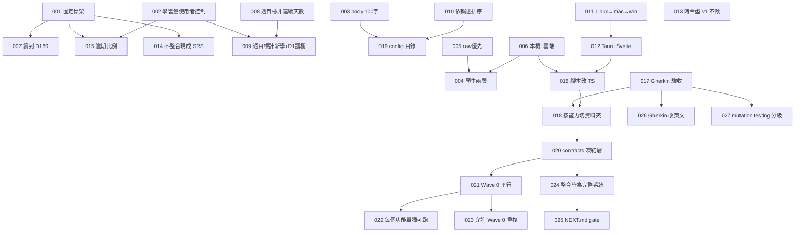

# Decision Map

所有有取捨的決定,ADR 格式,只增不刪。被推翻的標 `superseded`,不刪除——
決策地圖的價值就在於看得到「當初為什麼這樣想、後來為什麼改」。

新增用 `/decide`。

## 怎麼讀

- **Status**:`accepted` 生效 / `superseded by ADR-XXX` 被推翻 / `proposed` 待確認
- **Context** 當時的情況與限制 · **Decision** 決定了什麼 · **Alternatives** 沒選的
- **Consequences** 好處與代價 · **Related** 相關 ADR 與 feature

## 依賴圖

---

## ADR-001 · 排程用固定骨架,不用自適應演算法

- **Status**: accepted · 2026-09-02
- **Context**: 使用者要求考「昨天、一週前、一個月前」,要可預期。FSRS 效果更好但間隔由模型決定,使用者無法預知今天考什麼。
- **Decision**: D1 / D7 / D30 為骨架,答錯退回 D1,連錯觸發重教。排程層為純函式獨立模組。
- **Alternatives**: FSRS 自適應;純固定無回退。
- **Consequences**: 可預期、零依賴、實作簡單。記憶效率略低於 FSRS。排程層可替換。
- **Related**: ADR-007, 014, 015, features/04-scheduler

## ADR-002 · 每日學習量由使用者控制

- **Status**: accepted · 2026-09-02
- **Context**: 原提案每天固定 N 個。使用者要主動權與三個按鈕。
- **Decision**: 教學卡是拉式,無每日上限。只顯示「今天已學 N,明天約 M 題」。
- **Alternatives**: 固定 N=1/2/3。
- **Consequences**: 考試量不可預測,因此需要每日題數上限(015)與週目標護欄(009)。
- **Related**: ADR-009, 015, features/07-teach-card

## ADR-003 · body 上限 100 字,範例圍欄不計

- **Status**: accepted · 2026-09-02
- **Context**: 使用者要「不要讓大腦學太多」,但範例需要空間。
- **Decision**: body ≤ 100(CJK 每字 1、非 CJK 連續序列 1、標點 0)。example 圍欄不計不限,可放圖。程式硬檢查。
- **Alternatives**: 200 / 300 字;範例也計。
- **Consequences**: 生成需重試機制;渲染需自訂 fence 插件。
- **Related**: contracts §2, features/01, 02, 07

## ADR-004 · 深入內容:預生 level 0–1,level 2+ 即時

- **Status**: accepted · 2026-09-02
- **Decision**: ingest 時產 level 0 與 1。level 2+ 按了才生,線上雲端、離線本機並標 provisional。
- **Alternatives**: 全預生;全即時。
- **Consequences**: 九成使用離線可用;需要 provisional 機制。
- **Related**: ADR-005, 006, features/07 phase-3

## ADR-005 · 內容來源 raw 優先,無 raw 才 LLM

- **Status**: accepted · 2026-09-02
- **Context**: 只用 raw 覆蓋率不足;只用 LLM 可信度不足,尤其資安。
- **Decision**: 有 raw 從 raw 產生並帶 source_ref;無 raw 由 LLM 依主題。每張卡帶 source。類別級 `require_raw` 可強制寧缺勿假。
- **Related**: ADR-019, features/02 phase-3

## ADR-006 · LLM 本機與雲端都要,依任務路由

- **Status**: accepted · 2026-09-02
- **Decision**: 單一 `call(task, prompt)` 介面,路由表決定 provider。生成類離線即拒絕;審核與深入可降級並標 provisional。
- **Related**: ADR-004, 016, contracts §7, features/03

## ADR-007 · D30 後繼續 D90、D180,再歸檔

- **Status**: accepted · 2026-09-02
- **Decision**: 五個檢查點,通過 D180 歸檔。
- **Consequences**: 穩態每日題數 ≈ 每日新學 × 5。配合上限 10,長期節奏約每天 2 個新概念。
- **Related**: ADR-001, 015

## ADR-008 · 遊戲化用週目標,不用連續天數

- **Status**: accepted · 2026-09-02
- **Context**: 連續天數有「斷一天就放棄」的已知失敗模式。
- **Decision**: 每週目標,達標即可,週一歸零,無懲罰。
- **Related**: ADR-009, features/08

## ADR-009 · 週目標計新學數,但須通過 D1

- **Status**: accepted · 2026-09-02
- **Context**: 使用者選新學數。設計者指出風險:猛按二十張、隔天考不完、下週歸零。
- **Decision**: 計數以「本週通過 D1 的卡片數」為準。滑過不算。
- **Consequences**: 護欄是設計者加的,使用者可拿掉。計數延後一天反映。
- **Related**: ADR-002, 008

## ADR-010 · 教學順序依 LLM 建立的依賴圖拓樸排序

- **Status**: accepted · 2026-09-02
- **Decision**: ingest 時標 prereqs、建圖、拓樸排序。軟性順序,不阻擋跳學,只顯示先備提示。
- **Consequences**: 需循環偵測;LLM 判斷可能出錯,lint 要能查。
- **Related**: ADR-019, features/01 phase-3, features/07 phase-2

## ADR-011 · 平台順序 Linux → macOS → Windows

- **Status**: accepted · 2026-09-02
- **Consequences**: Wayland 置頂限制需偵測並提示。
- **Related**: ADR-012, features/10

## ADR-012 · 桌面框架用 Tauri 2 + Svelte 5

- **Status**: accepted · 2026-09-02
- **Context**: 需要輕量常駐視窗、系統列、跨平台。使用者授權設計者決定。
- **Alternatives**: Electron。
- **Consequences**: 需 Rust toolchain;體積小、記憶體低;跨平台成本低。
- **Related**: ADR-011, 016

## ADR-013 · 時令型內容 v1 不做

- **Status**: accepted · 2026-09-02
- **Context**: 桃樹管理等季節驅動知識不符合間隔重複模型。
- **Decision**: v1 只做記憶型。時令型留 v2,需要日曆驅動的卡片型別。

## ADR-014 · 不整合現成 SRS 專案,只借概念

- **Status**: accepted · 2026-09-02
- **Context**: 使用者原想把多個開源專案放同一資料夾接線。Anki / SiYuan / Logseq 資料模型與執行環境各異,整合等於重寫。
- **Decision**: 自建。因選固定骨架(001),連 FSRS 函式庫也不需要。
- **Related**: ADR-001

## ADR-015 · 每日上限 10 題,優先序用逾期比例

- **Status**: accepted · 2026-09-02
- **Context**: 原提案「先考到期最久的」被設計者自我修正:D1 晚一天是逾期 100%,D180 晚一天是 0.5%。
- **Decision**: 每日 ≤ 10(可調);優先序 = 逾期天數 ÷ 該 stage 間隔。
- **Related**: ADR-001, 002, 007

## ADR-016 · 腳本改用 TypeScript

- **Status**: accepted · 2026-09-02 · 修正 00-design.md §8
- **Context**: 設計文件寫 Python。但 llm-router 桌面端是 TS,腳本用 Python 就要兩份路由。
- **Decision**: 所有非 Rust 程式碼用 TypeScript,核心放 `packages/core` 共用,腳本用 tsx。
- **Consequences**: 單一語言、單一路由、單一型別。放棄 Python 生態,改用 zod。
- **Related**: ADR-006, 012, 018

## ADR-017 · 用 Gherkin 當驗收規格與測試

- **Status**: accepted · 2026-09-02
- **Decision**: 每個 phase 一個 `.feature`,cucumber 執行。`@manual` 由人確認。沒有 gherkin 不開工。
- **Related**: ADR-018, 026, 027

## ADR-018 · features/ 按能力切,不按里程碑切

- **Status**: accepted · 2026-09-02
- **Context**: 一個能力橫跨多個階段;按階段切會讓同一能力的 gherkin 散落。
- **Decision**: 一個能力一個資料夾,內含多個 phase。roadmap 負責對應到 wave / integration。
- **Related**: ADR-016, 017, 020

## ADR-019 · 新增 config/ 目錄

- **Status**: accepted · 2026-09-02 · 補充 00-design.md §3.1
- **Decision**: `config/categories.yaml` 與 `config/settings.yaml`。
- **Related**: ADR-005, 009, 015

## ADR-020 · 新增 contracts/ 凍結層

- **Status**: accepted · 2026-09-02
- **Context**: 使用者要求「一開始各個資料夾第一階段完全能平行實做」。平行的唯一障礙是「A 需要 B 的型別才能動」。
- **Decision**: 抽出 `contracts/`:所有跨模組型別、檔案格式、函式簽章、路由表、fixture 規範。Wave 0 開始後凍結,修改需 ADR 並列出要重驗的 phase。
- **Alternatives**: 讓 01-data-layer 先做完當前置(那樣就沒有平行);每個模組自己定義介面,整合時協調(整合會撞成一團)。
- **Consequences**: 多一層要維護。改契約成本高——這是刻意的。換來十個資料夾真正平行。
- **Related**: ADR-018, 021, contracts/

## ADR-021 · Wave 0:十個 phase-1 完全平行,禁止跨資料夾 import

- **Status**: accepted · 2026-09-02
- **Context**: 使用者要求第一階段完全平行。
- **Decision**: 每個資料夾的 phase-1 只能 import `contracts/` 與自己的目錄。需要別人的能力就用 contract 介面 + 自己的 stub。這條由 `/phase-done` 檢查。
- **Alternatives**: 允許依賴但排順序(那不是平行);只讓部分資料夾平行(複雜度不減、好處減半)。
- **Consequences**: 十個資料夾可同時開工。代價是 Wave 0 有重複(見 023)。
- **Related**: ADR-020, 022, 023

## ADR-022 · 每個功能必須能單獨執行,整合後仍然要能

- **Status**: accepted · 2026-09-02
- **Context**: 使用者要求「每個資料夾內的功能也能單獨運行」。
- **Decision**: 每個 `FEATURE.md` 有「單獨執行」段落,寫一行可複製的指令。`/phase-done` 實際執行它。整合後仍須能跑——這是刻意的耦合約束。
- **Alternatives**: 只在 Wave 0 要求(那整合後模組會慢慢黏死)。
- **Consequences**: 每個模組要有 CLI 或 dev server 入口,是額外工作。換來的是模組永遠可以單獨 debug,以及一個永遠有效的耦合檢測器。
- **Related**: ADR-021

## ADR-023 · 接受 Wave 0 的重複,整合時移除

- **Status**: accepted · 2026-09-02
- **Context**: 平行的代價是幾份 FakeLlmRouter、幾個最小驗證器。
- **Decision**: 接受。每個 `FEATURE.md` 有「Wave 0 的重複」表,列出東西、位置、在哪個整合點移除。`/integrate` 逐一檢查。
- **Alternatives**: 為了避免重複而排順序(等於放棄平行)。
- **Consequences**: 一點重複遠比一個依賴鏈便宜。額外好處:09-lint 的獨立驗證器與 01 的驗證器可以互相對照,結論不同就代表契約有歧義——這是只有在有兩份獨立實作時才做得到的檢查。
- **Related**: ADR-021, features/09 NEXT.md

## ADR-024 · 每個整合點都必須是完整可用的系統

- **Status**: accepted · 2026-09-02
- **Context**: 使用者要求「每一次整合就是一個完整可用的系統」。
- **Decision**: 八個整合點,每個的驗收 gherkin 都必須有至少一個 `@e2e` 場景描述「一個人從頭到尾做完一件有意義的事」。寫不出來就代表切錯了,重切。每個整合檔另有 `@regression` 場景驗證前一個整合點沒被弄壞。
- **Alternatives**: 按技術層次整合(先全部後端再全部前端)——那樣中間好幾個月沒有可用的東西。
- **Consequences**: I2 之後系統就有價值。專案在任何整合點停下來,手上都有能用的東西。代價是整合點的切法受限,不能純粹按技術方便切。
- **Related**: ADR-025, docs/integration/

## ADR-025 · 每個資料夾用 NEXT.md 管理 gate

- **Status**: accepted · 2026-09-02
- **Context**: 使用者要求「每個資料夾內也要有文檔指揮 AI 何時進行下一步的 gherkin 開發」。
- **Decision**: 每個資料夾一個 `NEXT.md`:目前狀態、下一個 phase 的 gate(自身 / 整合 / 契約三類)、gate 未滿足時該做什麼、完成後解鎖什麼。`/sprint` 讀它決定 ready,不手動改狀態。
- **Alternatives**: 只在 roadmap 集中管理(AI 在資料夾內工作時看不到);只靠 FEATURE.md 的依賴表(說得出「等什麼」但說不出「現在該做什麼」)。
- **Consequences**: 「gate 未滿足時該做什麼」是最有價值的段落——它防止 AI 在等待時瞎猜介面、寫出要重寫的程式。
- **Related**: ADR-024

## ADR-026 · Gherkin 用英文,文件用中文

- **Status**: accepted · 2026-09-02 · 修正 ADR-017 的語言選擇
- **Context**: 使用者要求 gherkin 全英文。
- **Decision**: 所有 `.feature` 用英文(cucumber 預設語言,無需 language 標頭)。`docs/`、`FEATURE.md`、`NEXT.md`、commands、skill 用繁體中文。
- **Alternatives**: 全中文(zh-TW,cucumber 原生支援);混用。
- **Consequences**: 步驟定義的字串是英文,與程式碼一致。中文的說明性文件保留在需要細膩表達的地方。
- **Related**: ADR-017

## ADR-027 · 導入 mutation testing 並分三級門檻

- **Status**: accepted · 2026-09-02
- **Context**: 使用者要求加入 mutation testing。這個專案的核心是排程邏輯,算錯要幾週後才發現,行覆蓋率抓不到。
- **Decision**: 用 Stryker。三級門檻:嚴格 95%(scheduler、grading 前兩層、字數與驗證器、weekly 計數、路徑防護)、標準 80%(ingest、lint、路由決策)、寬鬆不強制(adapter、CLI、UI 元件)。`/phase-done` 前必跑。技能檔 `.claude/skills/mutation-testing/`。
- **Alternatives**: 只用行覆蓋率(抓不到「執行到但沒驗證」);全專案統一門檻(UI 追高分沒有意義,會浪費時間)。
- **Consequences**: 驗收變慢。換來排程與審核邏輯的信心。明確禁止「為衝分數寫斷言」——那會在重構時變成阻力。
- **Related**: ADR-017, .claude/skills/mutation-testing/

## ADR-028 · 組合層不參與 Wave 0

- **Status**: accepted · 2026-09-02
- **Context**: v2 漏了一個交付物:整合 gherkin 到處寫 "the review command",但沒有任何 feature 資料夾產出它。04 是純函式、05 是審核、06 是 UI,沒有人負責把它們串起來。
- **Decision**: 新增 `11-review-cli`,phase-1 在 I2。它**不參與 Wave 0**——組合層在被組合的東西存在之前無法獨立,硬造一個吃 stub 的版本等於寫兩次。這是 ADR-021 的明確例外。
- **Alternatives**: 把 CLI 塞進 04 或 05(職責不對);讓它有一個吃 stub 的 Wave 0 版本(重工)。
- **Consequences**: Wave 0 是十一個 phase 不是十二個。`11-review-cli` 同時是 `06-test-card` 的行為規格來源——CLI 先定案,UI 只是換皮。
- **Related**: ADR-021, features/11-review-cli

## ADR-029 · 契約分硬約定與軟約定

- **Status**: accepted · 2026-09-02 · 修正 ADR-020
- **Context**: v1.0 把整份契約都凍死。但 TypeScript 型別改了編譯器會抓、測試會抓,走 ADR 是儀式不是保護。使用者也反映「不要約束太緊」。
- **Decision**: **硬約定**(磁碟格式 §2 §3 §4 §8–§12,加 §7 的 `LlmTask` 與路由表)改動需 ADR。**軟約定**(記憶體介面 §5 §6 §13、§7 的函式簽章)改了跑測試、更新文件、commit 說明理由即可。
- **Alternatives**: 全凍(太重);全不凍(AI 跨 session 會漂移)。
- **Consequences**: 改函式簽章不再是一場儀式。磁碟格式仍然受保護,因為改了會讓已產生的資料失效。契約升版至 1.1.0。
- **Related**: ADR-020, contracts/README.md

## ADR-030 · 只有嚴格級的變異門檻是硬性的

- **Status**: accepted · 2026-09-02 · 修正 ADR-027
- **Context**: v2 讓 `/phase-done` 在任何門檻未達時都擋住。對 UI 與 adapter 來說這是浪費時間。
- **Decision**: **嚴格級(95%)未達 → 擋住**,因為那些模組算錯的代價是延遲數週才顯現。**標準級(80%)未達 → 回報但不擋**,由你決定要不要處理。**寬鬆級 → 不跑。**
- **Alternatives**: 全部硬性(拖慢);全部軟性(排程邏輯會鬆掉)。
- **Consequences**: 驗收變快。代價是標準級模組的測試品質靠自律。這個取捨是刻意的:嚴格級涵蓋了所有「錯了會靜默」的地方。
- **Related**: ADR-027

## ADR-031 · 流程分核心與選配,可以只用核心

- **Status**: accepted · 2026-09-02
- **Context**: 一百多個檔案的流程對一個人來說偏重。使用者要求「不要約束太緊」。
- **Decision**: 明確區分**核心**(契約、gherkin、`/phase-done` 的測試與單獨執行檢查)與**選配**(sprint 檔、`/integrate` 的完整清單、decision map 的 mermaid 圖、變異測試的標準級)。`03-agile-workflow.md` 新增「最小模式」段落說明只用核心怎麼跑。
- **Alternatives**: 全部必做(會被放棄);刪掉選配的部分(專案長大時會後悔)。
- **Consequences**: 流程是為了保護你不犯已知的錯,不是為了被遵守而存在。用不到就關掉,需要時再開。
- **Related**: ADR-025, docs/03-agile-workflow.md

## ADR-032 · prompt 改動需要 golden run

- **Status**: accepted · 2026-09-02
- **Context**: `packages/core/prompts/` 決定卡片、考題、審核的品質,但它不是程式,型別檢查與單元測試都抓不到。LLM 產品最常見的靜默退化就是改了 prompt、品質下降、幾週後才發現。
- **Decision**: 新增 `12-prompt-quality`。每個 prompt 任務有固定的 golden 輸入;改 prompt 要跑一次 live golden run 並與基準比對;人打分數(兩個維度各 1–5)。工具**不判斷品質**,只讓變化被看見。另有結構性自動檢查(字數、JSON 合法、rubric 條數)。
- **Alternatives**: 不做(唯一會靜默毀掉品質的洞);用 LLM 自動評分(評分者跟被評者同源,信不過)。
- **Consequences**: 改 prompt 多一道手續。`CLAUDE.md` 加一條:改了 prompt 沒跑 golden 就 commit,是這個專案唯一會靜默毀掉品質的操作。
- **Related**: features/12-prompt-quality

## ADR-033 · cucumber 用 tsx 的 ESM loader 載入 TypeScript

- **Status**: accepted · 2026-09-02
- **Context**: `@cucumber/cucumber` 11 + `"type": "module"`,步驟檔是 TypeScript。載入方式有 ts-node、tsx、先編譯三種,而這件事擋住所有自動驗收。
- **Decision**: `package.json` 的三個 `accept*` 腳本前綴 `NODE_OPTIONS=--import=tsx`;`cucumber.js` 維持 `import: ['features/steps/**/*.ts']`。步驟檔之間互相 import 寫 `./_world.js`(ESM 慣例,tsx 對應到 `.ts`)。
- **Alternatives**: ts-node/esm(維護慢、ESM 支援不穩);先 `tsc` 再跑(多一步,而且 vitest 與 scripts 已經都走 tsx)。
- **Consequences**: 整個 repo 的 TypeScript 執行只有一條路(tsx)。Windows(I8)要把 `NODE_OPTIONS=` 前綴改成 `cross-env`,到時再處理。**注意 `cucumber.js` 本身的格式**:`export default` 本身就是 default profile 的內容,不能再包一層 `default: {...}`——包了會讓 `@cucumber/cucumber` 11 安靜退回內建預設,`import` 完全不會發生,所有 step 變成 undefined,看起來像「還沒實作」而不是設定錯了。Wave 0 scaffold 時埋了這個坑,多個 worker 各自撞見,詳見 ADR-036。
- **Related**: ADR-016, ADR-017, ADR-036, features/steps/README.md

## ADR-034 · 雲端 provider 用 OpenAI,模型名只從環境變數來

- **Status**: accepted · 2026-09-02
- **Context**: 待決表的「雲端 provider 與模型」擋著 03-llm-router/phase-1 的 `@llm` 場景。使用者決定用 OpenAI,金鑰在 `.env`(`OPENAI_API_KEY`,已 gitignore),模型名 `gpt-5.6-luna`(協調者已用 API 驗證存在)。
- **Decision**: provider 與模型名不寫死在程式碼。依契約 §11 從 `LLM_CLOUD_PROVIDER` / `LLM_CLOUD_MODEL` 讀,其次 `settings.llm`。`.env.example` 記錄變數名與目前值;只有 CLI 入口用 `process.loadEnvFile` 載入 `.env`,library 只讀 `process.env`。OpenAI adapter 用 `max_completion_tokens`(該模型不接受 `max_tokens`)。
- **Alternatives**: 寫死模型名(換模型要改程式);同時做 Anthropic adapter 的真呼叫(契約保留 `anthropic` 值,adapter 要有,但 Wave 0 只有 OpenAI 有金鑰,Anthropic 走 mock)。
- **Consequences**: 換模型只改 `.env`。`contracts/fixtures/learning-minimal/config/settings.yaml` 仍寫 anthropic 當範例,環境變數會覆蓋它。
- **Related**: ADR-006, contracts/types.md §7 §11, features/03-llm-router/FEATURE.md

## ADR-035 · Wave 0 平行開發的落點與共用檔歸屬

- **Status**: accepted · 2026-09-02
- **Context**: 使用者決定打破 WIP ≤ 2,十一個 phase-1 各開一個 git worktree 同時做。互踩只會發生在共用檔與同一個目錄,所以要在分叉前定好。
- **Decision**:
  1. 落點表在 `packages/core/README.md`,`scripts/check-boundaries.ts` 的 `OWNERS` 是同一份表的程式版。每個功能一個 `packages/core/src/<name>/`(含自己的 stub),UI 在 `apps/<name>/`。
  2. `packages/ui-shared/`(example 圍欄插件)Wave 0 由 07-teach-card 擁有;06-test-card 在 I3 前不 import 它。
  3. 共用檔只有協調者改:`package.json`、lock、`tsconfig.json`、`cucumber.js`、`standalone.json`、`features/steps/_world.ts`、`features/steps/common.steps.ts`、`docs/01-roadmap.md`、本檔。worker 把需求寫在自己 FEATURE.md 的「待協調」段。
  4. 出現在兩個以上資料夾的 gherkin 句子只在 `common.steps.ts` 定義一次;只用在 `@manual` 場景的句子不定義。
  5. 所有依賴一次裝在 root(workspaces hoisting),worktree 只跑 `npm ci`,不動 lock。
  6. 合併順序:01 先,再 04,其餘隨到隨合;每次合併後跑 `boundaries`、`test`、`accept:standalone`、`standalone`。
- **Alternatives**: 各 worktree 自己加依賴與 workspace(lock 必衝);允許 06 與 07 同時寫 ui-shared(同檔互踩)。
- **Consequences**: worker 的自由度小一點,但合併幾乎不會衝突。`CLAUDE.md` 的「WIP ≤ 2」在 Wave 0 暫時不適用,Wave 0 之後恢復。
- **Related**: ADR-021, ADR-022, ADR-023, packages/core/README.md, scripts/check-boundaries.ts

## ADR-036 · cucumber.js 設定檔格式修正、standalone 指令的預期退出碼

- **Status**: accepted · 2026-09-02
- **Context**: Wave 0 十一個 phase-1 平行開發期間,四個獨立 worker(01、03、04、08,後續 09、10、12 也各自回報同一件事)分別發現 `cucumber.js` 的 `export default { default: {...} }` 巢狀寫法在 `@cucumber/cucumber` 11 + `package.json` `"type":"module"` 下不會被正確解析——ESM `await import()` 讀到的是 `{ default: <export default 的值> }`,程式只在該值是 function 時才展開,object 時直接當設定物件用,於是 `paths`/`import`/`tags` 全部讀不到,`npm run accept*` 對全 repo 每個功能都回報所有 step undefined。ADR-033 決定了 loader 機制(tsx + `--import`),但沒發現這個設定檔本身的格式錯誤,一路帶到 Wave 0 平行開發才被多個 worker 各自撞見。另外,09-lint 的單獨執行指令設計上就該回傳非 0(找到問題就是要失敗),但 `scripts/check-standalone.ts` 原本一律要求退出碼 0。
- **Decision**:
  1. `cucumber.js` 的 `export default` 直接就是 default profile 的內容,不再包一層 `default: {...}`;移除已棄用的 `publishQuiet`。額外 profile 要用具名 export(例如 `export const ci = {...}`),不要塞進這個物件。
  2. `standalone.json` 的每個項目可以加 `expectExit`(選填,預設 0),`scripts/check-standalone.ts` 用它比對退出碼而不是寫死要求 0。`09-lint` 設成 1。
- **Alternatives**: 針對 09-lint 在 `check-standalone.ts` 特殊判斷資料夾名稱(硬編碼例外,難維護);cucumber.js 改用具名 export 取代 `export default`(要同步改 `package.json` 的 `--profile` 參數,改動面更大)。
- **Consequences**: 這個 bug 存在期間,所有 worker 的 `npm run accept:standalone` 都是假失敗,只能用 `NODE_OPTIONS=--import=tsx npx cucumber-js --import 'features/steps/**/*.ts'` 繞過驗證——這件事後續被 phase-acceptance 拿來當「不要照抄範例設定檔,要跑得動才算數」的教訓。順帶在收尾複查時發現 `packages/core/src/llm/router.ts`(FEATURE.md 標嚴格 95%)合併時變異測試只有 52.54%,審核階段沒人針對它單獨重跑 Stryker——之後嚴格級模組的審核要明確在報告裡點名每一個「檔案級」嚴格門檻,不能只看整個目錄的總分。
- **Related**: ADR-033, ADR-035, packages/core/README.md, features/*/FEATURE.md 的「待協調」段

## ADR-037 · 本機模型延後,不是 v1 就要做

- **Status**: accepted · 2026-09-03
- **Context**: 待決表的「本機模型與硬體」擋著 03-llm-router/phase-2 的本機 adapter。機器實測:`ollama` 已安裝但沒在跑、`~/.ollama/models` 是空的(12K)、GPU 是 GTX 1650(**4GB VRAM**)、RAM 31GB。14B(Q4 約 9GB)塞不進 GPU 會大半跑 CPU、很慢;7B(約 4.7GB)部分 offload 可用但應用審核能力有限;3B 全進 GPU 快但更弱。使用者決定**先跳過本機模型,不是永久不做**——確認過契約 §7 的路由表本來就定義了「離線+無本機」這個分支(`ingest.*`、`deepen`、`grade.apply`、`reteach.short` 丟 `NO_MODEL`/`CLOUD_REQUIRED`,`grade.fill.llm` 丟 `NO_MODEL`),§5 的 `fallback-strict` grader 就是給填空第三層沒本機模型時走的,所以「跳過本機」等於系統長期停在 `probeLocal()` 回傳 `{ available: false, models: [] }` 這個契約已經定義好的狀態,不需要改硬約定。
- **Decision**: 本機模型延到 I6 或之後,gate 是「使用者決定要裝哪個模型、什麼時候裝」,不是技術上做不到。落實:
  1. `03-llm-router/phase-2` 範圍收斂成:路由表(契約 §7)+ 雲端 adapter(已在 phase-1 做完)+ 上線偵測 + `probeLocal` 固定回 `{ available: false, models: [] }`。這部分嚴格 95% 門檻不變,要測滿。
  2. 本機 adapter(真的呼叫 ollama HTTP API)與所有「本機模型可用」的場景,搬到 `03-llm-router` 的新 phase(phase-4,phase-3 保留給 ADR 之前規劃的 provisional 佇列,兩者都掛在「使用者決定裝本機模型」這個 gate 下)。FEATURE.md 標 `todo`,NEXT.md 契約 gate 寫清楚。
  3. `05-grading/phase-3`(離線審核)與 I6 涉及本機推論的那一半,gate 同上,一併延後。I1–I5 的其餘 phase 不受影響,照原計畫走。
- **Alternatives**: 現在就裝 7B 湊合用(使用者評估 4GB VRAM 效果不夠好,不值得為了湊 v1 而用一個體驗差的本機模型);永久砍掉本機模型只留雲端(使用者明確表示是延後不是砍,保留 §7 路由表與 fallback-strict 設計讓之後隨時能補)。
- **Consequences**: 離線時(no wifi/沒網路)應用審核與深入生成不可用、填空第三層固定走 fallback-strict,這是契約本來就設計好的降級路徑,不是新缺口。03-llm-router/phase-2 的契約 gate 解除,可以立刻跟 01-data-layer/phase-3 平行開工。I6(長期維護、provisional 複審)在使用者真的裝本機模型前,價值會打折扣,到時候再評估要不要調整範圍。
- **Related**: ADR-034, contracts/types.md §5 §7, features/03-llm-router/NEXT.md, features/03-llm-router/FEATURE.md

---

## 待決(不影響開工)

| 項目 | 需在何時前決定 | 阻擋什麼 |
|---|---|---|
| ~~雲端 provider 與模型~~ | 已決定(ADR-034) | — |
| 本機模型與硬體 | 延後(ADR-037),gate 見 03-llm-router/NEXT.md | 03-llm-router 本機 adapter 那個 phase、05-grading/phase-3、I6 的離線那一半 |
| 週目標預設值是否維持 7 | I5 前 | 無 |
| 通知 / 提醒時間 | I5 後 | 無 |
| 時令型卡片設計 | v2 | 無(ADR-013) |
| 跨機器同步:git 手動 vs Syncthing | I7 前 | 無 |
| ~~cucumber 的 TypeScript loader 設定~~ | 已決定(ADR-033) | — |
| golden 評分的維度與規模 | I2 前 | 12-prompt-quality/phase-2 |

## 已推翻

(目前無。被推翻的 ADR 保留在上方並標 superseded,這裡列索引。)
